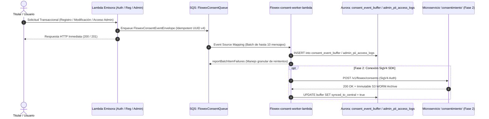

# Arquitectura Global del Sistema Flowex

Flowex es una plataforma tecnológica orientada a la logística y distribución de paquetería y envíos en Chile. Su arquitectura está diseñada 100% sobre un modelo **Serverless Event-Driven** en Amazon Web Services (AWS), garantizando alta disponibilidad, escalabilidad elástica, desacoplamiento asíncrono y costos optimizados por transacción.

---

## 🏗️ Diagrama de Arquitectura de Microservicios

```mermaid
graph TB
    subgraph Clientes & Interfaces
        WebApp[Flowex Frontend SPA / React]
        DriverApp[Flowex Driver App / Mobile]
        PublicUser[Público General / Tracking]
        AdminPortal[Flowex Admin & Support Portal]
    end

    subgraph "API Gateway & Enrutamiento"
        APIGW[Amazon API Gateway / Ingress]
    end

    subgraph "Microservicios Serverless (AWS Lambdas)"
        AuthLambda["Flowex-auth-api-lambda<br>(Login, Refresh, Logout, Validate)"]
        RegPublicLambda["Flowex-registration-public-lambda<br>(RUT Módulo 11, S3 Comprobantes)"]
        OtpLambda["Flowex-otp-service-lambda<br>(OTP, Meta WhatsApp Cloud API)"]
        PaymentsLambda["Flowex-payments-api-lambda<br>(Mercado Pago & Fintoc Open Banking)"]
        NotifLambda["Flowex-notification-lambda<br>(Amazon SES Emails, SMS)"]
        AuthAdminLambda["Flowex-auth-admin-lambda<br>(Gestión Usuarios VPC)"]
        RegAdminLambda["Flowex-registration-admin-lambda<br>(Overrides & Activación Forzada)"]
        ConsentWorkerLambda["Flowex-consent-worker-lambda<br>(Node.js 24 ARM64 / SQS Batch Worker)"]
    end

    subgraph "Servicios Externos & Proveedores"
        MetaAPI[Meta WhatsApp Cloud API]
        MPAPI[Mercado Pago Checkout Pro]
        FintocAPI[Fintoc Open Banking A2A]
        SESAPI[Amazon Simple Email Service - SES]
    end

    subgraph "Almacenamiento & Eventos Asíncronos"
        S3Bucket[(Amazon S3 - Comprobantes)]
        SQSNotifQueue[[Amazon SQS - Notification Queue]]
        SQSConsentQueue[[Amazon SQS - FlowexConsentQueue<br>+ Dead Letter Queue FlowexConsentDLQ]]
        LocalDB[(PostgreSQL Aurora<br>consent_event_buffer & admin_pii_access_logs)]
    end

    subgraph "Gobernanza Centralizada (Fase 2)"
        ConsentCentral["Microservicio 'consentimiento'<br>(SigV4 / DynamoDB / S3 Glacier WORM)"]
    end

    WebApp -->|HTTPS API REST| APIGW
    DriverApp -->|HTTPS API REST| APIGW
    PublicUser -->|Tracking / Registro| APIGW
    AdminPortal -->|HTTPS Admin REST| APIGW

    APIGW -->|/auth/*| AuthLambda
    APIGW -->|/registration/*| RegPublicLambda
    APIGW -->|/otp/*, /notifications/whatsapp| OtpLambda
    APIGW -->|/payments/*, /webhooks/*| PaymentsLambda
    APIGW -->|/notifications/*| NotifLambda
    APIGW -->|/internal/users/* (VPC)| AuthAdminLambda
    APIGW -->|/admin/registration-requests/*| RegAdminLambda

    RegPublicLambda -->|Upload Base64| S3Bucket
    OtpLambda -->|Envío de Plantillas| MetaAPI
    OtpLambda -->|Despacho Evento SQS| SQSNotifQueue
    PaymentsLambda -->|Crear Preferencia / Webhooks| MPAPI
    PaymentsLambda -->|Payment Intent / Webhooks| FintocAPI
    SQSNotifQueue -->|Consumo Asíncrono Worker| NotifLambda
    NotifLambda -->|Despacho Transaccional| SESAPI

    %% Flujos de Consentimiento y Auditoría PII
    RegPublicLambda -.->|Enqueue RECORD_CONSENT| SQSConsentQueue
    AuthLambda -.->|Enqueue REVOKE_CONSENT| SQSConsentQueue
    AuthAdminLambda -.->|Enqueue PII_ACCESS_AUDIT| SQSConsentQueue
    RegAdminLambda -.->|Enqueue PII_ACCESS_AUDIT| SQSConsentQueue

    SQSConsentQueue -->|SQS Batch Event (10 msg)| ConsentWorkerLambda
    ConsentWorkerLambda -->|Fase 1: Persistencia Buffer Local| LocalDB
    ConsentWorkerLambda -.->|Fase 2: Conexión SigV4 Directa| ConsentCentral
```

---

## 🧩 Componentes del Ecosistema

### 1. `Flowex-frontend`
* **Tecnologías:** React 19, TypeScript, Vite, Tailwind CSS, Lucide Icons.
* **Módulos:**
  * **Portal Cliente / Customer:** Creación de solicitudes de despacho, cotizador de tarifas por peso/zona, tracking en tiempo real y pasarela de pago integrada.
  * **Portal Conductor / Driver:** Hoja de ruta diaria, escaneo de paquetes, validación de entrega mediante PIN de 4 dígitos (`deliveryCode`) y carga de Proof of Delivery (POD) con foto y firma digital.
  * **Panel de Control / Admin:** Dashboard ejecutivo de envíos, asignación de rutas, gestión de incidencias logísticas y control de usuarios.

### 2. `Flowex-shared-layer` (Capa Compartida)
* Contiene utilidades transversales empaquetadas como Lambda Layer:
  * Validación estricta de RUT chileno mediante algoritmo Módulo 11 (`rut.ts`).
  * Generación y validación de tokens JWT (`jwt.ts`).
  * Generación de Status Tokens HMAC-SHA256 (`status-token.ts`).
  * Estructuras de respuesta normalizadas con soporte CORS (`response.ts`).
  * Tipado TypeScript compartido (`types.ts`).

### 3. Microservicios de Autenticación y Usuarios
* **`Flowex-auth-api-lambda`:** Expone endpoints públicos para login, renovación de access tokens (`/auth/refresh`), logout y validación de estado de sesión (`/auth/validate`), operando con tokens JWT de 1 hora y refresh tokens de 30 días fijados en cookies HttpOnly seguras.
* **`Flowex-auth-admin-lambda`:** Microservicio interno desplegado dentro de una VPC privada para la administración y CRUD de usuarios del sistema con roles `root`, `admin`, `driver` y `client`. Emite eventos `PII_ACCESS_AUDIT` ante la inspección de datos sensibles.

### 4. Microservicios de Onboarding y Registro
* **`Flowex-registration-public-lambda`:** Procesa solicitudes iniciales de clientes y choferes. Valida la complejidad de la contraseña, el RUT chileno y el teléfono celular E.164, sube comprobantes de domicilio o de empresa a Amazon S3 y encola el evento de consentimiento legal `RECORD_CONSENT`.
* **`Flowex-otp-service-lambda`:** Genera códigos OTP numéricos de 6 dígitos con tiempo de expiración y los envía mediante Meta WhatsApp Cloud API o SMS. Al verificar el código, auto-activa la cuenta a estado `APPROVED` y despacha eventos a Amazon SQS.
* **`Flowex-registration-admin-lambda`:** Permite a operadores de nivel `admin` y `root` realizar aprobaciones forzadas, rechazos o activaciones manuales de registros que requieran revisión humana, registrando auditorías PII.

### 5. Pasarelas de Pago (`Flowex-payments-api-lambda`)
* **Mercado Pago:** Integración con Checkout Pro / WebPay para pagos con tarjeta de débito, crédito y dinero en cuenta.
* **Fintoc:** Integración Open Banking A2A (Account to Account) para transferencias bancarias instantáneas verificadas mediante firmas criptográficas `x-fintoc-signature`.
* **Webhooks:** Receptores asíncronos para la actualización automática del estado de pago de las órdenes (`paid`, `payment_failed`).

### 6. Notificaciones Transaccionales (`Flowex-notification-lambda`)
* Soporta invocación HTTP directa y ejecución asíncrona como worker de Amazon SQS.
* Envía correos HTML responsivos a través de Amazon SES (Verificación de cuenta, Bienvenida, Confirmación de orden con PIN de seguridad, y Actualizaciones de estado de envío).
* Soporta notificaciones vía SMS.

### 7. Consentimientos y Auditoría PII (`Flowex-consent-worker-lambda`)
* **8vo Microservicio Serverless:** Diseñado en **Node.js 24** sobre arquitectura **ARM64 (AWS Graviton2)** para maximizar eficiencia y reducir huella de cómputo.
* **Ingestión Asíncrona vía SQS:** Desacopla la captura de consentimientos y auditorías de los flujos transaccionales mediante colas dedicadas (`FlowexConsentQueue` y `FlowexConsentDLQ`).
* **Cumplimiento Regulatorio:** Da estricto cumplimiento a la **Ley N° 21.719 (Chile)** y estándares internacionales tipo GDPR para el registro inmutable de consentimientos y la trazabilidad de accesos administrativos a datos sensibles (PII).

### 8. Infraestructura como Código (`Flowex-iac`)
* Todo el aprovisionamiento de AWS (VPC, API Gateway, S3, colas SQS, Lambdas, IAM Roles y parámetros SSM) se gestiona mediante **AWS CDK** en TypeScript.

---

## 🛡️ Arquitectura de Consentimiento y Auditoría PII (Ley N° 21.719)

Para cumplir con el marco de protección de datos personales chileno sin degradar la latencia de las APIs principales, Flowex adopta una estrategia de **Buffer Local Asíncrono en Fase 1** con transición planificada a un microservicio central de gobernanza en **Fase 2**.



### Contrato y Esquema de Eventos SQS

Todos los microservicios emisores encolan eventos encapsulados en la siguiente estructura canónica:

```typescript
export type FlowexConsentEventType = 'RECORD_CONSENT' | 'REVOKE_CONSENT' | 'PII_ACCESS_AUDIT';

export interface FlowexConsentEventEnvelope<T = unknown> {
  eventId: string;                 // UUID v4 idempotente generado por el emisor
  eventType: FlowexConsentEventType;
  timestamp: string;               // ISO 8601 UTC
  appId: 'flowex';                // Identificador constante para gobernanza multi-app
  environment: 'dev' | 'prod';
  payload: T;
  context: {
    originEndpoint: string;        // ej. "/api/v1/public/register" o "/api/v1/admin/users/details"
    clientIp?: string;             // IP pública del titular o administrador
    userAgent?: string;            // User Agent del cliente
    callerServiceId: string;       // ej. "flowex-registration-public", "flowex-auth-admin"
    correlationId?: string;        // Trace ID / X-Ray / Request ID
  };
}
```

#### 1. Payload: `RECORD_CONSENT`
Registra el otorgamiento explícito de finalidades de tratamiento de datos al registrarse o actualizar el perfil.
```json
{
  "userId": "usr_9b1deb4d-3b7d-4bad-9bdd-2b0d7b3dcb6d",
  "purposes": [
    { "purpose": "terms_and_conditions", "granted": true, "policyVersion": "v2.4 (Ley N° 21.719)" },
    { "purpose": "delivery_tracking", "granted": true, "policyVersion": "v2.4 (Ley N° 21.719)" },
    { "purpose": "marketing_promo", "granted": false, "policyVersion": "v2.4 (Ley N° 21.719)" }
  ],
  "channel": "web_registration",
  "acceptedAt": "2026-08-24T12:00:00.000Z"
}
```

#### 2. Payload: `REVOKE_CONSENT`
Registra la revocación o derecho de oposición del titular a una o varias finalidades no esenciales.
```json
{
  "userId": "usr_9b1deb4d-3b7d-4bad-9bdd-2b0d7b3dcb6d",
  "purposes": ["marketing_promo"],
  "reason": "Solicitud expresa de cese de promociones publicitarias",
  "revokedAt": "2026-08-24T14:30:00.000Z",
  "channel": "web_settings"
}
```

#### 3. Payload: `PII_ACCESS_AUDIT`
Registra obligatoriamente cualquier consulta o exportación de datos personales por parte de operadores o administradores.
```json
{
  "adminId": "adm_8c2cfb5e-4c8e-5cbe-0cee-3c1e8c4edb7e",
  "adminRole": "admin",
  "targetUserId": "usr_9b1deb4d-3b7d-4bad-9bdd-2b0d7b3dcb6d",
  "action": "VIEW_USER_PROFILE",
  "reason": "Verificación manual de RUT y comprobante de domicilio para activación",
  "accessedFields": ["rut", "email", "phone", "comprobante_s3_url", "home_address"],
  "timestamp": "2026-08-24T15:00:00.000Z"
}
```

### Deuda Técnica y Plan de Transición (Fase 1 ➔ Fase 2)

La especificación completa de arquitectura, contratos de migración y mitigación de deuda técnica se encuentra documentada en el documento máster:
👉 [`technical-debt-consent-integration.md`](file:///C:/Users/joyta/OneDrive/Desktop/inspytech/flowEx/technical-debt-consent-integration.md).

* **Fase 1 (Actual):** Ingestión asíncrona SQS, ejecución en `Flowex-consent-worker-lambda` y persistencia en las tablas locales `consent_event_buffer` y `admin_pii_access_logs`. Cero acoplamiento externo y tolerancia total a fallos con DLQ de 14 días.
* **Fase 2 (Próxima):** Activación de `CONSENT_SERVICE_ENABLED=true`, integración mediante `ConsentClient` SDK firmado con **AWS SigV4**, sincronización continua con el microservicio transversal `consentimiento` (DynamoDB Multi-App) y archivo WORM de 6 años en **Amazon S3 Glacier**.
