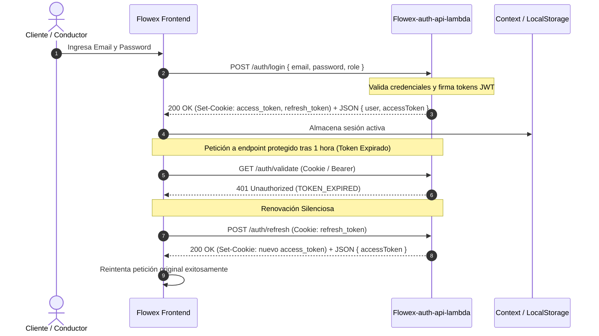

# Autenticación y Gestión de Sesiones (Auth)

El módulo de autenticación de Flowex proporciona un esquema de seguridad robusto basado en **JSON Web Tokens (JWT)** y cookies **HttpOnly**, desacoplando el acceso público de la gestión interna de credenciales.

---

## 🎭 Matriz de Roles y Permisos

| Rol | Alcance | Operaciones Principales |
| :--- | :--- | :--- |
| `root` | Super Administrador | Acceso irrestricto a toda la infraestructura, asignación de roles y configuraciones globales |
| `admin` | Administrador Operacional | Gestión de choferes, monitoreo de envíos, asignación de rutas, resolución de incidentes y overrides |
| `driver` | Conductor / Repartidor | Visualización de hojas de ruta asignadas, escaneo de paquetes, validación de PIN y subida de POD |
| `client` | Cliente / Remitente | Creación de envíos, cotización, pago mediante pasarelas (Mercado Pago / Fintoc) y tracking |

---

## 🔄 Flujo de Autenticación y Renovación de Tokens



---

## 🍪 Configuración de Cookies y Seguridad

Para mitigar ataques XSS (Cross-Site Scripting) y CSRF (Cross-Site Request Forgery), los tokens se envían tanto en el cuerpo de la respuesta como en encabezados `Set-Cookie` con las siguientes directivas:

```http
Set-Cookie: access_token=<JWT>; HttpOnly; Secure; SameSite=None; Max-Age=3600; Path=/
Set-Cookie: refresh_token=<JWT>; HttpOnly; Secure; SameSite=None; Max-Age=2592000; Path=/
```

* **`HttpOnly`**: Impide el acceso al token desde scripts de JavaScript en el navegador.
* **`Secure`**: Exige transporte exclusivo sobre canales cifrados HTTPS.
* **`SameSite=None`**: Permite el envío de credenciales seguras entre distintos subdominios (`flowex.cl` y `api.flowex.cl`).
* **Duración:**
  * `access_token`: 1 hora (`3600s`).
  * `refresh_token`: 30 días (`2592000s`).

---

## 📡 Especificación de Endpoints

### 1. Iniciar Sesión (`POST /auth/login`)
Valida las credenciales del usuario y emite los tokens de acceso y renovación.

* **Encabezados:** `Content-Type: application/json`
* **Cuerpo de Solicitud (`JSON`):**
```json
{
  "email": "conductor1@flowex.cl",
  "password": "PasswordSegura2026!",
  "role": "driver"
}
```

* **Respuesta Exitosa (`200 OK`):**
```json
{
  "accessToken": "eyJhbGciOiJIUzI1NiIsInR5cCI6IkpXVCJ9...",
  "refreshToken": "eyJhbGciOiJIUzI1NiIsInR5cCI6IkpXVCJ9...",
  "user": {
    "sub": "usr_flowex_123",
    "email": "conductor1@flowex.cl",
    "name": "Usuario FlowEx",
    "role": "driver"
  }
}
```

---

### 2. Cerrar Sesión (`POST /auth/logout`)
Invalida la sesión activa eliminando las cookies del cliente.

* **Encabezados Requeridos:** `Authorization: Bearer <access_token>` o Cookie `access_token`.
* **Respuesta (`200 OK`):**
```json
{
  "message": "Logout exitoso"
}
```

---

### 3. Renovar Token de Acceso (`POST /auth/refresh`)
Genera un nuevo `access_token` a partir de un `refresh_token` válido.

* **Cuerpo Opcional:** `{ "refreshToken": "<token>" }` (Si no se provee por Cookie).
* **Respuesta (`200 OK`):**
```json
{
  "accessToken": "eyJhbGciOiJIUzI1NiIsInR5cCI6IkpXVCJ9..."
}
```

---

### 4. Validar Sesión Activa (`GET /auth/validate`)
Verifica la validez del token y retorna los claims del usuario.

* **Encabezados:** `Authorization: Bearer <token>` o Cookie `access_token`.
* **Respuesta (`200 OK`):**
```json
{
  "valid": true,
  "user": {
    "sub": "usr_flowex_123",
    "email": "conductor1@flowex.cl",
    "name": "Usuario FlowEx",
    "role": "driver",
    "iat": 1771344000,
    "exp": 1771347600,
    "iss": "flowex-auth"
  }
}
```

* **Respuestas de Error (`401 Unauthorized`):**
```json
{
  "valid": false,
  "message": "TOKEN_EXPIRED"
}
```
o
```json
{
  "valid": false,
  "message": "INVALID_TOKEN"
}
```

---

### 5. Cambio de Contraseña (`POST /auth/change-password`)
Permite actualizar la contraseña de una cuenta autenticada.

* **Cuerpo de Solicitud:**
```json
{
  "token": "eyJhbGciOiJIUzI1NiIsInR5cCI6IkpXVCJ9...",
  "password": "PasswordActual123!",
  "newPassword": "NuevaPasswordRobusta2026!"
}
```
* **Respuesta (`200 OK`):**
```json
{
  "message": "Clave actualizada exitosamente"
}
```
