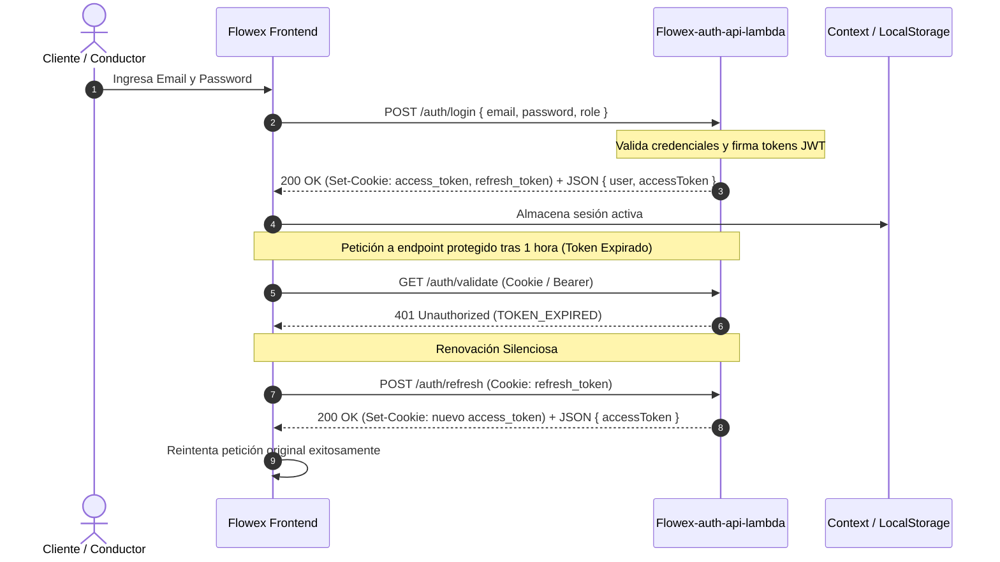

# Autenticación y Gestión de Sesiones (Auth)

El módulo de autenticación de Flowex proporciona un esquema de seguridad robusto basado en **JSON Web Tokens (JWT)** y cookies **HttpOnly**, desacoplando el acceso público de la gestión interna de credenciales.

---

## 🎭 Matriz de Roles y Permisos

| Rol | Alcance | Operaciones Principales |
| :--- | :--- | :--- |
| `root` | Super Administrador | Acceso irrestricto a toda la infraestructura, asignación de roles y configuraciones globales |
| `admin` | Administrador Operacional | Gestión de choferes, monitoreo de envíos, asignación de rutas, resolución de incidentes y overrides |
| `driver` | Conductor / Repartidor | Visualización de hojas de ruta asignadas, escaneo de paquetes, validación de PIN y subida de POD |
| `client` | Cliente / Remitente | Creación de envíos, cotización, pago mediante pasarelas (Mercado Pago / Fintoc) y tracking |

---

## 🔄 Flujo de Autenticación y Renovación de Tokens



---

## 🍪 Configuración de Cookies y Seguridad

Para mitigar ataques XSS (Cross-Site Scripting) y CSRF (Cross-Site Request Forgery), los tokens se envían tanto en el cuerpo de la respuesta como en encabezados `Set-Cookie` con las siguientes directivas:

```http
Set-Cookie: access_token=<JWT>; HttpOnly; Secure; SameSite=None; Max-Age=3600; Path=/
Set-Cookie: refresh_token=<JWT>; HttpOnly; Secure; SameSite=None; Max-Age=2592000; Path=/
```

* **`HttpOnly`**: Impide el acceso al token desde scripts de JavaScript en el navegador.
* **`Secure`**: Exige transporte exclusivo sobre canales cifrados HTTPS.
* **`SameSite=None`**: Permite el envío de credenciales seguras entre distintos subdominios (`flowex.cl` y `api.flowex.cl`).
* **Duración:**
  * `access_token`: 1 hora (`3600s`).
  * `refresh_token`: 30 días (`2592000s`).

---

## 📡 Especificación de Endpoints

### 1. Iniciar Sesión (`POST /auth/login`)
Valida las credenciales del usuario y emite los tokens de acceso y renovación.

* **Encabezados:** `Content-Type: application/json`
* **Cuerpo de Solicitud (`JSON`):**
```json
{
  "email": "conductor1@flowex.cl",
  "password": "PasswordSegura2026!",
  "role": "driver"
}
```

* **Respuesta Exitosa (`200 OK`):**
```json
{
  "accessToken": "eyJhbGciOiJIUzI1NiIsInR5cCI6IkpXVCJ9...",
  "refreshToken": "eyJhbGciOiJIUzI1NiIsInR5cCI6IkpXVCJ9...",
  "user": {
    "sub": "usr_flowex_123",
    "email": "conductor1@flowex.cl",
    "name": "Usuario FlowEx",
    "role": "driver"
  }
}
```

* **Cuenta bloqueada (`403 Forbidden`):** las credenciales correctas no bastan; el estado
  de la cuenta se lee de `users.is_active`.
```json
{
  "message": "Tu cuenta se encuentra bloqueada. Motivo: Fraude documentado en 3 envíos",
  "code": "BLOCKED",
  "reason": "Fraude documentado en 3 envíos",
  "blockedAt": "2026-09-15T12:00:00.000Z"
}
```

> **Alcance del bloqueo.** Además del login, se comprueba en `POST /auth/refresh`,
> `GET /auth/validate`, `POST /auth/change-password` y en los dos endpoints de
> consentimiento de autoservicio. Un token emitido antes de `users.sessions_revoked_at`
> se rechaza con `code: "SESSION_REVOKED"`, de modo que bloquear a alguien alcanza a la
> sesión que ya tenía abierta sin esperar a que expire el access token.
>
> Si la base de datos no está configurada o no responde, la comprobación se omite y se
> registra un aviso: una caída de base no debe convertirse en una denegación masiva de
> acceso.

---

### 2. Cerrar Sesión (`POST /auth/logout`)
Invalida la sesión activa eliminando las cookies del cliente.

* **Encabezados Requeridos:** `Authorization: Bearer <access_token>` o Cookie `access_token`.
* **Respuesta (`200 OK`):**
```json
{
  "message": "Logout exitoso"
}
```

---

### 3. Renovar Token de Acceso (`POST /auth/refresh`)
Genera un nuevo `access_token` a partir de un `refresh_token` válido.

* **Cuerpo Opcional:** `{ "refreshToken": "<token>" }` (Si no se provee por Cookie).
* **Respuesta (`200 OK`):**
```json
{
  "accessToken": "eyJhbGciOiJIUzI1NiIsInR5cCI6IkpXVCJ9..."
}
```

---

### 4. Validar Sesión Activa (`GET /auth/validate`)
Verifica la validez del token y retorna los claims del usuario.

* **Encabezados:** `Authorization: Bearer <token>` o Cookie `access_token`.
* **Respuesta (`200 OK`):**
```json
{
  "valid": true,
  "user": {
    "sub": "usr_flowex_123",
    "email": "conductor1@flowex.cl",
    "name": "Usuario FlowEx",
    "role": "driver",
    "iat": 1771344000,
    "exp": 1771347600,
    "iss": "flowex-auth"
  }
}
```

* **Respuestas de Error (`401 Unauthorized`):**
```json
{
  "valid": false,
  "message": "TOKEN_EXPIRED"
}
```
o
```json
{
  "valid": false,
  "message": "INVALID_TOKEN"
}
```

---

### 5. Cambio de Contraseña (`POST /auth/change-password`)
Permite actualizar la contraseña de una cuenta autenticada.

* **Cuerpo de Solicitud:**
```json
{
  "token": "eyJhbGciOiJIUzI1NiIsInR5cCI6IkpXVCJ9...",
  "password": "PasswordActual123!",
  "newPassword": "NuevaPasswordRobusta2026!"
}
```
* **Respuesta (`200 OK`):**
```json
{
  "message": "Clave actualizada exitosamente"
}
```

---

## 🔐 Segundo Factor de Autenticación (2FA / MFA)

Para mitigar riesgos de robo de credenciales en cuentas con acceso a infraestructura o rutas de reparto en vivo, Flowex implementa un segundo factor de autenticación de dos pasos.

### Políticas de Aplicación por Rol
* **Mandatorio (`root`, `admin`, `driver`):** Todo inicio de sesión requiere un desafío 2FA de 6 dígitos. No puede ser desactivado por el usuario.
* **Opcional (`client`):** El cliente puede activar o desactivar 2FA desde su perfil de usuario (`PATCH /auth/security`). Por defecto se mantiene desactivado para agilizar el checkout.
* **Canal único: correo.** El código viaja por SQS a `Flowex-notification-lambda` y sale por Amazon SES; vence a los 5 minutos. Flowex no envía SMS: `supportedChannels` es siempre `["email"]`.
* **Sandbox:** fuera de producción (`STAGE=dev`, `NODE_ENV=development`/`test` o `SANDBOX_MODE=true`) la respuesta trae `sandboxCode` con el código emitido, para probar sin revisar el correo. Con `STAGE=prod` o `NODE_ENV=production` nunca se activa.

---

### 6. Desafío de Segundo Paso (`POST /auth/login` con 2FA)
Cuando el usuario tiene 2FA requerido o habilitado, `POST /auth/login` no emite tokens definitivos, sino un `mfaToken` temporal firmado (TTL 5 minutos):

* **Respuesta (`200 OK` con desafío 2FA):**
```json
{
  "mfaRequired": true,
  "mfaToken": "eyJhbGciOiJIUzI1NiIsInR5cCI6IkpXVCJ9...",
  "channel": "email",
  "maskedEmail": "r***t@flowex.cl",
  "maskedPhone": "+56 9 **** 7217",
  "supportedChannels": ["email"],
  "expiresInSeconds": 300,
  "sandboxCode": "481902",
  "isSandbox": true
}
```

---

### 7. Verificación de Código 2FA (`POST /auth/login/verify-2fa`)
Valida el código de 6 dígitos ingresado por el usuario junto con el `mfaToken`.

* **Cuerpo de Solicitud:**
```json
{
  "mfaToken": "eyJhbGciOiJIUzI1NiIsInR5cCI6IkpXVCJ9...",
  "code": "123456"
}
```
* **Respuesta Exitosa (`200 OK`):**
Retorna los tokens definitivos (`accessToken`, `refreshToken`), establece las cookies `HttpOnly` y retorna el perfil de usuario autenticado.
```json
{
  "message": "Segundo factor verificado exitosamente",
  "accessToken": "eyJhbGciOiJIUzI1NiIsInR5cCI6IkpXVCJ9...",
  "refreshToken": "eyJhbGciOiJIUzI1NiIsInR5cCI6IkpXVCJ9...",
  "user": {
    "sub": "usr_flowex_root",
    "email": "root@flowex.cl",
    "name": "Super Admin",
    "role": "root",
    "mfaEnabled": true
  }
}
```
* **Errores (`400 / 429`):**
  * `400 Bad Request`: Código inválido o expirado. Retorna `remainingAttempts`.
  * `429 Too Many Requests`: Se excedió el límite de 5 intentos fallidos. El `mfaToken` queda invalidado.

---

### 8. Reenvío del código 2FA (`POST /auth/login/resend-2fa`)
Reenvía un código nuevo al correo. No hay otro canal.

* **Cuerpo de Solicitud:**
```json
{
  "mfaToken": "eyJhbGciOiJIUzI1NiIsInR5cCI6IkpXVCJ9..."
}
```
* **Respuesta Exitosa (`200 OK`):**
```json
{
  "success": true,
  "message": "Código de verificación reenviado exitosamente por correo.",
  "mfaToken": "eyJhbGciOiJIUzI1NiIsInR5cCI6IkpXVCJ9...",
  "channel": "email",
  "maskedDestination": "r***t@flowex.cl",
  "expiresInSeconds": 300,
  "sandboxCode": "730215",
  "isSandbox": true
}
```
* **Errores (`429 Too Many Requests`):** Si se solicita un reenvío antes de cumplir el cooldown de 60 segundos.

---

### 9. Configuración de Seguridad de Cuenta (`PATCH /auth/security`)
Permite al usuario autenticado (rol `client`) activar o desactivar la exigencia de 2FA en sus inicios de sesión.

* **Encabezados:** `Authorization: Bearer <access_token>`
* **Cuerpo de Solicitud:**
```json
{
  "mfaEnabled": true
}
```
* **Respuesta Exitosa (`200 OK`):**
```json
{
  "success": true,
  "mfaEnabled": true,
  "message": "Configuración de autenticación de dos pasos actualizada exitosamente."
}
```
* **Error (`403 Forbidden`):** Para roles `root`, `admin` y `driver`, retornando: `"El segundo factor de autenticación es obligatorio para su rol por política de seguridad y no puede ser deshabilitado."`

