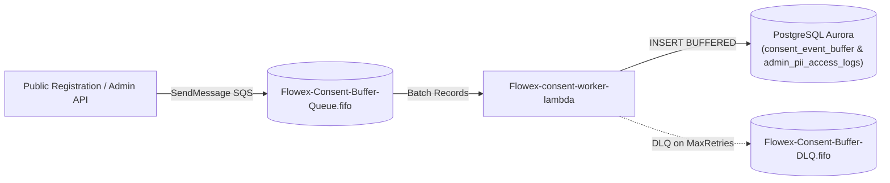

# Consent Worker, Buffer de Eventos y Auditoría PII

## Visión General

El módulo de **Consent Worker y Auditoría PII** proporciona una arquitectura desacoplada y de alta resiliencia mediante colas **Amazon SQS FIFO** para la ingestión asíncrona de eventos de consentimiento de usuarios y registros de auditoría de acceso a datos personales (PII).



---

## Tipos de Eventos SQS Soportados

El worker procesa tres tipos de eventos estructurados:

| Event Type | Origen Habitual | Propósito | Tabla de Destino |
|---|---|---|---|
| `RECORD_CONSENT` | `Flowex-registration-public-lambda` | Registro inicial o actualización de aceptación de términos / políticas | `consent_event_buffer` |
| `REVOKE_CONSENT` | Dashboard de usuario / settings | Revocación explícita de consentimiento de finalidades | `consent_event_buffer` |
| `PII_ACCESS_AUDIT` | `Flowex-auth-admin-lambda` / APIs internas | Trazabilidad de consultas y visualización de PII por administradores | `admin_pii_access_logs` |

---

## Esquema de Base de Datos (Migración 010)

### 1. Tabla `consent_event_buffer`
Almacena el búfer transaccional de eventos de consentimiento para posterior reconciliación o sincronización.

```sql
CREATE TABLE IF NOT EXISTS consent_event_buffer (
    id UUID PRIMARY KEY DEFAULT gen_random_uuid(),
    user_id VARCHAR(255) NOT NULL,
    app_id VARCHAR(50) DEFAULT 'flowex',
    event_type VARCHAR(50) NOT NULL,
    purpose VARCHAR(100) NOT NULL,
    policy_version VARCHAR(50),
    channel VARCHAR(50),
    origin_endpoint VARCHAR(255),
    ip_address VARCHAR(45),
    user_agent TEXT,
    reason TEXT,
    status VARCHAR(50) DEFAULT 'BUFFERED',
    created_at TIMESTAMPTZ DEFAULT CURRENT_TIMESTAMP,
    forwarded_at TIMESTAMPTZ
);

CREATE INDEX IF NOT EXISTS idx_consent_buffer_user_id ON consent_event_buffer(user_id);
CREATE INDEX IF NOT EXISTS idx_consent_buffer_created_at ON consent_event_buffer(created_at);
CREATE INDEX IF NOT EXISTS idx_consent_buffer_status ON consent_event_buffer(status);
```

### 2. Tabla `admin_pii_access_logs`
Almacena el registro inmutable de auditoría para el cumplimiento de normativas de protección de datos (ej. Ley 19.628 / GDPR).

```sql
CREATE TABLE IF NOT EXISTS admin_pii_access_logs (
    id UUID PRIMARY KEY DEFAULT gen_random_uuid(),
    admin_id VARCHAR(255) NOT NULL,
    target_user_id VARCHAR(255),
    action VARCHAR(100) NOT NULL,
    reason TEXT,
    origin_endpoint VARCHAR(255),
    ip_address VARCHAR(45),
    user_agent TEXT,
    log_id VARCHAR(100),
    created_at TIMESTAMPTZ DEFAULT CURRENT_TIMESTAMP
);

CREATE INDEX IF NOT EXISTS idx_admin_pii_admin_id ON admin_pii_access_logs(admin_id);
CREATE INDEX IF NOT EXISTS idx_admin_pii_target_user_id ON admin_pii_access_logs(target_user_id);
CREATE INDEX IF NOT EXISTS idx_admin_pii_created_at ON admin_pii_access_logs(created_at);
```

---

## Especificación Técnica de Deuda Técnica y Evolución Futura

### Estado Actual (Fase Transicional)
1. **Buffer Local**: Los microservicios emiten mensajes a la cola SQS de Flowex y el worker persiste localmente en Aurora con estado `BUFFERED`.
2. **Desacoplamiento Operacional**: Si el servicio centralizado de consentimiento se encuentra no disponible o en despliegue, el onboarding y administración no sufren impacto de latencia ni fallos de red.

### Hoja de Ruta / Deuda Técnica
1. **Forwarder Cron / Stream**: Implementar proceso de reenvío en lotes hacia el microservicio central `consentimiento-importal-lambda` actualizando `forwarded_at` y estado `PROCESSED`.
2. **Reintentos y DLQ Monitoring**: Alarmas CloudWatch sobre `Flowex-Consent-Buffer-DLQ.fifo` integradas con canal Sentinel Discord.
3. **Firmas Criptográficas**: Verificación de firmas de integridad en los payloads de auditoría PII.
