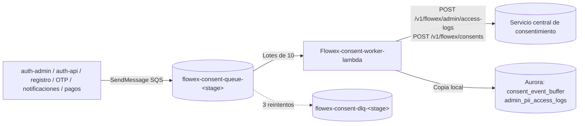

# Consent Worker y registro de uso de datos personales

## Visión general

Los servicios de Flowex no escriben directamente en el servicio central de consentimiento.
Publican eventos en la cola **Amazon SQS estándar** `flowex-consent-queue-<stage>` y el worker
(`Flowex-consent-worker-lambda`) los reenvía a la central, que es lo que revisan los auditores
en el portal. En Aurora queda una copia local.


```mermaid
flowchart LR
    A["auth-admin / auth-api / registro / OTP / notificaciones / pagos"] -->|SendMessage SQS| B[("flowex-consent-queue-&lt;stage&gt;")]
    B -->|Lotes de 10| C["Flowex-consent-worker-lambda"]
    C -->|POST /v1/flowex/admin/access-logs<br/>POST /v1/flowex/consents| D[("Servicio central de consentimiento")]
    C -->|Copia local| E[("Aurora: consent_event_buffer<br/>admin_pii_access_logs")]
    B -.->|3 reintentos| F[("flowex-consent-dlq-&lt;stage&gt;")]
```

La cola es **estándar, no FIFO**: entrega cada mensaje al menos una vez. Por eso cada evento
lleva un `eventId` que la central usa como clave de idempotencia (ver más abajo).

---

## Tipos de evento

| Event Type | Origen | Propósito | Destino |
|---|---|---|---|
| `RECORD_CONSENT` | registro público, auth-api, OTP | Aceptación de términos y finalidades | Central + `consent_event_buffer` |
| `REVOKE_CONSENT` | auth-api (panel del titular) | Revocación de una finalidad | Central + `consent_event_buffer` |
| `PII_ACCESS_AUDIT` | auth-admin, OTP, notificaciones, pagos | Uso de datos personales: acceso del personal o uso automático | Central (`admin-access-logs`) + `admin_pii_access_logs` |

### `PII_ACCESS_AUDIT`

```json
{
  "eventId": "evt_1727700000000_ab12cd34",
  "eventType": "PII_ACCESS_AUDIT",
  "timestamp": "2026-09-30T12:00:00.000Z",
  "appId": "flowex",
  "payload": {
    "adminId": "4f1c…",
    "adminRole": "admin",
    "targetUserId": "tel:sha256:…",
    "action": "VIEW_ORDER",
    "reason": "Detalle de un pedido",
    "declaredReason": "Llamado de soporte",
    "accessedFields": ["recipientName", "recipientPhone"],
    "timestamp": "2026-09-30T12:00:00.000Z"
  },
  "context": {
    "originEndpoint": "/internal/orders/…",
    "clientIp": "200.1.1.1",
    "userAgent": "…",
    "callerServiceId": "flowex-auth-admin-lambda"
  }
}
```

- **Un evento por titular.** Un listado de 40 pedidos genera hasta 80 eventos (cliente y
  destinatario de cada uno).
- **`targetUserId`**: con cuenta, el uuid de `users` (la misma clave de sus consentimientos);
  sin cuenta, `tel:sha256:<hex>` de los últimos 9 dígitos del teléfono o
  `email:sha256:<hex>` del correo en minúsculas. Un correo nunca viaja en claro.
- **`reason`** lo fija la ruta. Lo que el usuario declara en la cabecera `x-audit-reason` va
  aparte, en `declaredReason`, y no reemplaza al oficial.
- **`accessedFields`**: nombres de campo, nunca valores.
- **`clientIp`** es la de `requestContext.identity.sourceIp` (API Gateway), no la cabecera
  `X-Forwarded-For`, que la escribe el cliente.
- **`action`** sale del catálogo cerrado `ACCIONES_DE_USO` de
  `Flowex-auth-admin-lambda/src/services/data-use-audit.ts`, equivalente al mapa del
  `ConsentAuditInterceptor` de Importal. El inventario de rutas está en
  `inventario-datos-personales.md`.
- El titular accediendo a sus propios datos no se registra.

---

## Qué hace el worker con un `PII_ACCESS_AUDIT`

1. Envía a la central `adminId`, `targetUserId`, `action`, `reason`, `originEndpoint`,
   `ipAddress`, `userAgent`, `actorRole`, `accessedFields`, `declaredReason` y, como clave de
   idempotencia, `idempotencyKey` = `eventId` con `occurredAt` = `timestamp`.
2. Si la central responde `DUPLICATE` (la cola entregó el mensaje dos veces), no escribe otra
   copia local.
3. Escribe la copia local en `admin_pii_access_logs`. Si falla, no reintenta: la central ya
   tiene el registro y un reintento lo duplicaría.
4. Si la central falla, el mensaje vuelve a la cola. Tras 3 intentos pasa a la DLQ.

### Aviso de volumen inusual

Al terminar cada lote, el worker cuenta los titulares distintos que cada persona del personal
registró en la última hora (`admin_pii_access_logs`). Si alguien cruza
`PII_VOLUME_ALERT_PER_HOUR` (500 por omisión), avisa **una vez** al canal del vigilante y deja
un log `PII_VOLUME_ALERT`. Los usos del sistema (`system:*`) y las consultas del portal de
auditores (`auditor:*`) no cuentan.

---

## Alarmas (Flowex-iac)

| Alarma | Qué mide |
|---|---|
| `flowex-consent-dlq-not-empty-<stage>` | Mensajes en la DLQ: registros que no llegaron a la central |
| `flowex-pii-audit-enqueue-failures-<stage>` | Métrica EMF `Flowex/UsoDeDatos` `EventosNoEncolados` de auth-admin |

Cada falla del worker además avisa a Discord con el vigilante (`ERROR_SENTINEL_*`).

---

## Esquema local (migración 010)

### `consent_event_buffer`

Copia de contingencia de los eventos de consentimiento.

```sql
CREATE TABLE IF NOT EXISTS consent_event_buffer (
    id UUID PRIMARY KEY DEFAULT gen_random_uuid(),
    user_id VARCHAR(255) NOT NULL,
    app_id VARCHAR(50) DEFAULT 'flowex',
    event_type VARCHAR(50) NOT NULL,
    purpose VARCHAR(100) NOT NULL,
    policy_version VARCHAR(50),
    channel VARCHAR(50),
    origin_endpoint VARCHAR(255),
    ip_address VARCHAR(45),
    user_agent TEXT,
    reason TEXT,
    status VARCHAR(50) DEFAULT 'BUFFERED',
    created_at TIMESTAMPTZ DEFAULT CURRENT_TIMESTAMP,
    forwarded_at TIMESTAMPTZ
);
```

### `admin_pii_access_logs`

Copia local del registro de uso de datos. La referencia es la central.

```sql
CREATE TABLE IF NOT EXISTS admin_pii_access_logs (
    id UUID PRIMARY KEY DEFAULT gen_random_uuid(),
    admin_id VARCHAR(255) NOT NULL,
    target_user_id VARCHAR(255),
    action VARCHAR(100) NOT NULL,
    reason TEXT,
    origin_endpoint VARCHAR(255),
    ip_address VARCHAR(45),
    user_agent TEXT,
    log_id VARCHAR(100),
    created_at TIMESTAMPTZ DEFAULT CURRENT_TIMESTAMP
);
```

`ip_address` es `VARCHAR(45)`: el worker guarda solo la primera IP de una lista y la recorta
a ese largo.
