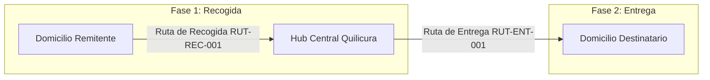

# Integración con Google Route Optimization API (Fleet Routing)

FlowEx utiliza el servicio **Google Cloud Route Optimization API** (anteriormente Cloud Fleet Routing o CFR) para resolver el problema de optimización de flotas vehiculares (Vehicle Routing Problem - VRP) en la Región Metropolitana de Santiago de Chile.

---

## 1. Arquitectura de Ruteo en 2 Fases

El ecosistema FlowEx opera con **dos rutas logísticas claramente separadas**:



1. **Ruta de Recogida (`RUT-REC-001` - `type: pickup`):**
   - **Partida:** Hub Central Quilicura (`lat: -33.3645, lng: -70.7321`).
   - **Paradas:** Puntos de retiro en domicilios de remitentes.
   - **Retorno:** Hub Central Quilicura para consolidación y clasificación.
2. **Ruta de Entrega (`RUT-ENT-001` - `type: delivery`):**
   - **Partida:** Hub Central Quilicura cargado con paquetes procesados.
   - **Paradas:** Puntos de entrega final en domicilios de destinatarios.
   - **Validación:** Entrega segura mediante **PIN de 4 dígitos** + foto POD.

---

## 2. Requerimientos de Datos (Waypoints Geoespaciales)

Google Route Optimization API **no acepta texto plano**; requiere un objeto `Waypoint` estructurado con coordenadas o identificador de lugar:

```typescript
export interface GoogleWaypoint {
  location?: {
    latLng: {
      latitude: number;   // WGS-84 (Ej: -33.4262800)
      longitude: number;  // WGS-84 (Ej: -70.6148200)
    };
  };
  placeId?: string;       // Google Maps Place ID ("ChIJ...")
  sideOfRoad?: boolean;   // true para forzar llegada al mismo lado de la calzada
  heading?: number;       // Dirección de avance en grados (0-359)
}
```

---

## 3. Especificación del Endpoint `optimizeTours`

* **Método:** `POST`
* **URL:** `https://routeoptimization.googleapis.com/v1/projects/{PROJECT_ID}:optimizeTours`
* **Headers:**
  * `Authorization: Bearer <GCP_OAUTH2_TOKEN>`
  * `Content-Type: application/json`

### Ejemplo de Payload de Envío (FlowEx Batch Request)

```json
{
  "model": {
    "shipments": [
      {
        "displayName": "Orden FLX-2026-1048",
        "pickups": [
          {
            "arrivalLocation": {
              "location": {
                "latLng": { "latitude": -33.42628, "longitude": -70.61482 }
              },
              "placeId": "ChIJN1t_tDeuEmsRUsoyG83frY4",
              "sideOfRoad": true
            },
            "duration": "300s",
            "label": "Retiro: Juan Remitente (Providencia)"
          }
        ],
        "demands": [
          { "type": "weight_kg", "value": 2.5 },
          { "type": "packages", "value": 1 }
        ]
      }
    ],
    "vehicles": [
      {
        "displayName": "Mercedes Sprinter KJL-942 (Juan Pérez)",
        "startLocation": {
          "location": {
            "latLng": { "latitude": -33.3645, "longitude": -70.7321 }
          },
          "placeId": "ChIJ_hub_central_quilicura_flowex"
        },
        "endLocation": {
          "location": {
            "latLng": { "latitude": -33.3645, "longitude": -70.7321 }
          }
        },
        "loadLimits": [
          { "type": "weight_kg", "maxLoad": 800 },
          { "type": "packages", "maxLoad": 120 }
        ]
      }
    ]
  }
}
```

---

## 4. Respuesta Optimizada (Secuencia de Paradas)

La respuesta de Google retorna el objeto `routes[0].visits` con las paradas ordenadas cronológicamente minimizando el costo total (distancia en metros y tiempo en segundos con tráfico predictivo):

```json
{
  "routes": [
    {
      "vehicleIndex": 0,
      "visits": [
        {
          "shipmentIndex": 0,
          "isPickup": true,
          "startTime": "2026-09-04T09:15:00Z"
        }
      ],
      "metrics": {
        "totalDuration": "7420s",
        "totalDistanceMeters": 48200
      }
    }
  ]
}
```

---

## 5. Componentes Frontend Disponibles en FlowEx

1. **`AddressMapPicker.tsx`:** Mapa interactivo para que el cliente seleccione y calibre sus coordenadas de retiro y entrega.
2. **`DriverRouteMap.tsx`:** Mapa interactivo con la secuencia numerada de paradas (`#1`, `#2`, `#3`...) y botón de navegación directa con Google Maps y Waze.
3. **`googleRouteOptimization.ts`:** Adaptador TypeScript para construir el payload `OptimizeToursRequest` y simulador de optimización heurística en el cliente.
