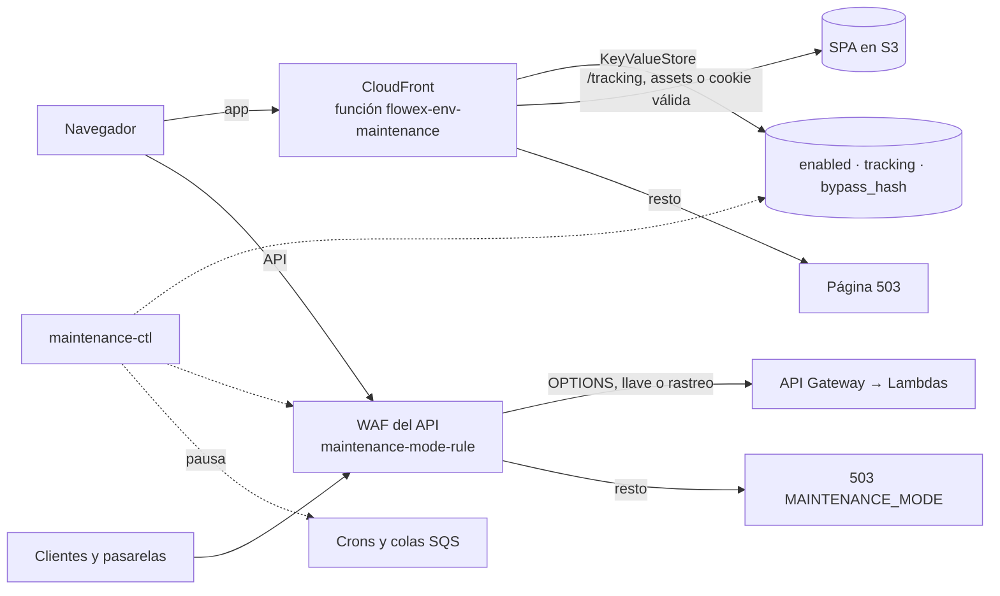

# Modo Mantenimiento

El modo mantenimiento corta el acceso público a Flowex sin apagar ningún servicio, por ejemplo durante una migración de base de datos. El equipo puede seguir usando la plataforma completa con una **llave de bypass**. El **rastreo público de envíos** es lo único que queda abierto para los usuarios, con un aviso de que puede fallar.

Se enciende y se apaga **sin desplegar**, con `Flowex-iac/scripts/maintenance-ctl.mjs`. Los cambios se propagan en segundos.

---

## 🧱 Capas del mecanismo



| Capa | Recurso | Encendido |
|---|---|---|
| **API** | Regla WAF `maintenance-mode-rule` (prioridad 0) en el Web ACL del stage | `503 MAINTENANCE_MODE` a todo, salvo las excepciones de la tabla siguiente. Cubre el dominio propio y la URL cruda de `execute-api`. |
| **Frontend** | CloudFront Function `flowex-<env>-maintenance` (viewer-request) + KeyValueStore `flowex-<env>-maintenance` | Página 503 sin caché, salvo `/tracking`, los archivos estáticos o un navegador con la cookie de bypass. |
| **Jobs** | EventBridge, Scheduler y event source mappings de SQS | Pausados, para que nada escriba en la base sin pasar por el API. |

---

## 🚦 Qué pasa y qué se bloquea en el API

| Petición | Durante el mantenimiento |
|---|---|
| Preflight de CORS (`OPTIONS`) | ✅ Pasa (si no, el navegador no podría ni enviar la llave) |
| Cualquier petición con `X-Maintenance-Bypass: <llave>` | ✅ Pasa |
| `GET /orders/{id}` **sin** `Authorization` (rastreo público) | ✅ Pasa, salvo con `on --no-tracking` |
| `GET /orders/{id}` **con** `Authorization` (expediente completo) | ⛔ 503 |
| Todo lo demás, incluidos `/auth/*`, `/payments/*` y `/webhooks/*` | ⛔ 503 |

Las rutas abiertas se comparan con el stage opcional delante (`^(/<stage>)?/orders/[^/]+$`), porque en `execute-api` el path trae el stage y en el dominio propio no. Las palabras reservadas bajo `/orders/` (`metrics`, `delivery-codes`…) pasan el WAF, pero la lambda exige sesión, así que sin token responden 401.

### Respuesta del API

```http
HTTP/1.1 503 Service Unavailable
Content-Type: application/json
Access-Control-Allow-Origin: https://<dominio de la app>
Access-Control-Allow-Credentials: true
Vary: Origin
Retry-After: 600
Cache-Control: no-store

{ "error": "MAINTENANCE_MODE", "message": "Flowex está en mantenimiento. Vuelve a intentarlo en unos minutos." }
```

- La lambda no interviene: el WAF responde antes.
- WAF admite un solo valor fijo de `Access-Control-Allow-Origin`, el dominio de la app del ambiente. Desde los orígenes `localhost` de desarrollo, el navegador ve un error de red en lugar del 503.
- En la [referencia OpenAPI](/reference.html) toda operación declara esta respuesta (`components.responses.MaintenanceMode`).
- Un 503 **sin** `error: "MAINTENANCE_MODE"` es un error de servidor común y se trata como tal.

---

## 🌐 Rutas de CloudFront (`/__mantenimiento`)

Las responde la CloudFront Function del dominio de la app, sin llegar a S3:

| Ruta | Respuesta |
|---|---|
| `GET /__mantenimiento/estado` | `200 {"enabled": true\|false, "bypass": true\|false}` con `Cache-Control: no-store`. Responde con el mantenimiento encendido o apagado; el SPA la consulta al iniciar. |
| `GET /__mantenimiento?llave=<llave>` | Con la llave correcta: `302 → /` y `Set-Cookie: flowex_bypass=<llave>; Path=/; Secure; SameSite=Strict; Max-Age=28800`. Con una llave incorrecta: la misma página 503 que vería cualquiera (o `302 → /` si no hay mantenimiento). |
| `GET /__mantenimiento/salir` | Borra la cookie y redirige a `/`. |

Con el mantenimiento encendido, el resto de las rutas de la app responde:

- **Rastreo y estáticos:** `/tracking` y todo archivo con extensión (`/assets/*`, favicon, manifest, imágenes) pasan a S3.
- **Cookie válida:** la app completa.
- **Todo lo demás:** `503` con una página HTML propia, `Cache-Control: no-store, no-cache, must-revalidate`, `Retry-After: 600` y un enlace **"Rastrear mi envío"** (sin enlace si el rastreo está cerrado).

---

## 🔑 Llave de bypass

| Dónde vive | Formato |
|---|---|
| SSM `/flowex/<env>/maintenance/bypass-key` (`SecureString`) | 64 caracteres hex (32 bytes aleatorios) |
| WAF: RegexPatternSet `flowex-<env>-maintenance-key` | `^<llave>$` |
| CloudFront: clave `bypass_hash` de la KeyValueStore | SHA-256 hex de la llave (nunca la llave en claro) |

- **Nunca en el código ni en el template.** El CDK crea el RegexPatternSet con `\x00`, un byte que HTTP no admite, así que no calza con nada hasta que se genera la llave. WAF rechaza las formas usuales de "nunca calza" (`[^\s\S]`, `a^`), y `^$` daría bypass con una cabecera vacía.
- **Del navegador al API:** el frontend (`httpClient` y `authHttpClient`) copia la cookie `flowex_bypass` en la cabecera `X-Maintenance-Bypass` de cada petición. El API vive en otro dominio y no recibe esa cookie. La cookie no es `HttpOnly` porque el SPA debe leerla.
- **Bruno:** la colección envía `X-Maintenance-Bypass: {{maintenance_bypass}}`. Vacía no tiene efecto.
- **Rotación:** `off` genera una llave nueva en cada cierre, porque la llave pasó por URLs, historial del navegador y logs. `generate-key` la rota a mano. Las cookies anteriores dejan de servir.

---

## 🖥️ Comportamiento del frontend

| Situación | Qué ve el usuario |
|---|---|
| Mantenimiento encendido, sin cookie | Solo `/tracking`. Cualquier otra ruta, incluso navegando dentro del SPA (logo, "Acceso clientes"), muestra **"Estamos en mantenimiento"** con el enlace al rastreo. |
| En `/tracking` | Banner fijo: *"Flowex está en mantenimiento. Puedes consultar el estado de tu envío, pero la información podría no estar disponible o no estar actualizada hasta que terminemos."* |
| La consulta de rastreo falla (5xx, timeout, 503) | *"No pudimos consultar tu envío porque estamos en mantenimiento. Vuelve a intentarlo en unos minutos."*, con botón de reintentar. Si el envío no aparece, se agrega que puede deberse al mantenimiento. |
| Con cookie de bypass | La app completa, con una franja amarilla *"Modo mantenimiento — acceso de desarrollo activo"* y el enlace *Salir del acceso*. |
| Pestaña abierta cuando empieza el mantenimiento | La primera respuesta `MAINTENANCE_MODE` del API cambia la vista a la pantalla de mantenimiento. |
| Fin del mantenimiento | La app vuelve a consultar `/__mantenimiento/estado` cada 60 s mientras dure, y se reabre sola. |

Además:

- **Sin reintentos:** las consultas no se reintentan ante `ApiMaintenanceError`, porque repetirían el mismo 503.
- **La sesión se conserva:** si el arranque de sesión (`/auth/refresh`) recibe 503, la sesión queda "no disponible", no se cierra ni se borra la pista de sesión. Al reabrir, el usuario sigue con su sesión.
- **Servidor local:** con el servidor de desarrollo, `/__mantenimiento/estado` responde `index.html` y la app asume que no hay mantenimiento.

---

## ⚙️ Jobs que se pausan

`on` pausa lo que escribe en la base sin pasar por el API, y guarda cómo estaba en `/flowex/<env>/maintenance/state`:

| Job | Recurso |
|---|---|
| Planificación diaria de rutas | Regla EventBridge `flowex-<env>-daily-route-planning` |
| Horario de oficina (solo dev) | Schedules `flowex-dev-office-hours-start/stop/check`. Si no se pausaran, `start` volvería a activar la planificación. |
| Notificaciones | Event source mapping SQS de `flowex-notification-<env>`. Los mensajes esperan en la cola. |
| Consentimientos | Event source mapping SQS de `flowex-consent-worker-<env>`. |

`off` los deja **exactamente** como estaban antes del `on`: no enciende lo que ya estaba apagado. Con `--keep-jobs` no se pausan. Los schedulers `consent-*-mark-stale-*` son del servicio central de consentimiento, que tiene su propia base, y no se tocan.

---

## 💳 Pagos durante el mantenimiento

- **Pagos nuevos:** nadie puede iniciarlos, porque `/payments/*` responde 503.
- **Webhooks:** `/webhooks/mercadopago` y `/webhooks/fintoc` **también reciben 503**, así no hay escrituras durante la migración. Solo quedan pendientes los pagos que estaban a medio camino al encender el mantenimiento.

| Pasarela | Reintentos ante una respuesta distinta de 2xx |
|---|---|
| **Mercado Pago** | Cada 15 minutos hasta recibir respuesta. Después del tercer intento espacia los envíos, pero no deja de enviarlos. |
| **Fintoc** | Backoff exponencial desde los 3 segundos, hasta 17 reintentos. No avisa cuando se rinde y no permite reenvío manual. Los eventos se recuperan con su guía *Recover missed events*. |

`status` advierte cuando un mantenimiento supera las 2 horas.

### Conciliación al reabrir

`off` imprime la ventana (inicio y término) y este recordatorio:

1. Lista los pagos que quedaron pendientes y se crearon o actualizaron desde un rato antes del inicio de la ventana.
2. Para cada uno, consulta [`GET /payments/mercadopago/status` o `GET /payments/fintoc/status`](/payments-webhooks). Esos endpoints consultan la pasarela y concilian contra la base.
3. Revisa en Mercado Pago (historial de notificaciones) y en el panel de Fintoc que los reintentos llegaron con 2xx.

---

## 🛠️ Operación (`maintenance-ctl`)

Desde `Flowex-iac`, con credenciales de AWS de la cuenta del ambiente:

```bash
node scripts/maintenance-ctl.mjs on     --env dev   # enciende (--no-tracking cierra también el rastreo; --keep-jobs no pausa jobs)
node scripts/maintenance-ctl.mjs url    --env dev   # URL /__mantenimiento?llave=… para obtener la cookie (8 h)
node scripts/maintenance-ctl.mjs test   --env dev   # comprueba cada capa desde afuera según el estado actual
node scripts/maintenance-ctl.mjs status --env dev   # estado de cada capa, jobs y avisos si no coinciden
node scripts/maintenance-ctl.mjs off    --env dev   # reabre, restaura jobs, rota la llave y recuerda conciliar pagos
node scripts/maintenance-ctl.mjs generate-key --env dev   # llave nueva a mano
```

- **Confirmación en prod:** cada comando que cambia algo pide escribir `prod`; `--yes` la omite.
- **Verificación:** `on` y `off` esperan a que WAF y CloudFront reflejen el cambio, con un máximo de 150 s.
- **Reparación:** repetir `on` arregla una capa que haya quedado mal, sin olvidar el estado previo de los jobs.

### Por qué no se despliega

El CDK crea los recursos una sola vez y el CLI solo cambia su contenido:

| Recurso | Nombre | Apagado |
|---|---|---|
| IPSet interruptor (IPv4 / IPv6) | `flowex-<env>-maintenance-switch-v4` / `-v6` | Vacío. Encendido contiene `0.0.0.0/1`, `128.0.0.0/1` (y `::/1`, `8000::/1`). |
| RegexPatternSet de la llave | `flowex-<env>-maintenance-key` | `\x00` hasta generar la llave |
| RegexPatternSet de rutas abiertas | `flowex-<env>-maintenance-open-paths` | `^(/<stage>)?/orders/[^/]+$`. Con `--no-tracking`, `\x00`. |
| KeyValueStore | `flowex-<env>-maintenance` | `enabled=off`. Una clave ausente cuenta como apagado. |

CloudFormation no vuelve a escribir estos recursos mientras su definición en el código no cambie, así que **desplegar durante un mantenimiento no lo apaga**. Si se cambia su definición, el despliegue los deja apagados y sin llave, y hay que volver a ejecutar `on`.

### Parámetros SSM (`/flowex/<env>/maintenance/*`)

| Parámetro | Lo escribe | Contenido |
|---|---|---|
| `kvs-arn`, `waf-switch-v4-arn`, `waf-switch-v6-arn`, `waf-key-arn`, `waf-open-paths-arn` | CDK | ARN de cada recurso |
| `bypass-key` | `maintenance-ctl` | Llave vigente (`SecureString`) |
| `state` | `maintenance-ctl` | `enabled`, `since`, `tracking`, estado previo de los jobs y `lastWindow` |
