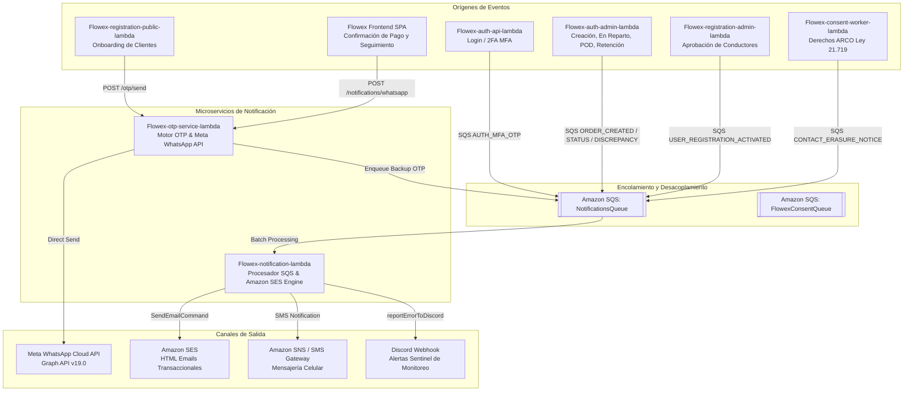

# Sistema Integral de Notificaciones Multicanal (Notifications)

El sistema de notificaciones de **Flowex** es un motor distribuido y multicanal diseñado bajo arquitectura **Event-Driven**. Coordina y despacha comunicaciones automáticas en tiempo real hacia clientes remitentes, destinatarios de paquetes, conductores y personal operativo a través de cuatro canales principales:

1. **Meta WhatsApp Business Cloud API (Graph API v19.0)**: Mensajería instantánea oficial con plantillas aprobadas por Meta (`Flowex-otp-service-lambda`).
2. **Amazon Simple Email Service (SES)**: Correos electrónicos transaccionales con diseño HTML corporativo responsivo (`Flowex-notification-lambda`).
3. **Mensajería SMS (AWS SNS / Twilio Gateway)**: Canal de alta penetración para verificación rápida y segundo factor (2FA).
4. **Bus de Eventos Asíncronos (Amazon SQS)**: Desacoplamiento de eventos de negocio mediante la cola `NotificationsQueue` y `FlowexConsentQueue`.
5. **Observabilidad y Alertas Operativas (Discord Webhooks)**: Notificaciones internas de fallos y excepciones no controladas mediante el middleware `withSentinel`.

---

## 🏗️ Arquitectura Global del Flujo de Notificaciones



---

## 📋 Catálogo Completo de Notificaciones por Canal

### 1. Canal Meta WhatsApp Business Cloud API (`Flowex-otp-service-lambda`)

Todas las plantillas de WhatsApp están tipadas en [`whatsapp-templates.ts`](file:///C:/Users/joyta/OneDrive/Desktop/inspytech/flowEx/Flowex-otp-service-lambda/src/whatsapp-templates.ts) y aprobadas por Meta:

| Evento del Sistema | Plantilla Oficial Meta | Categoría | Variables Dinámicas | Destinatario Principal |
| :--- | :--- | :--- | :--- | :--- |
| **Emisión de Código OTP** | `flowex_otp_code` | `AUTHENTICATION` | `{{1}}` Código OTP numérico (6 dígitos) | Solicitante de Registro / Inicio de Sesión |
| **Envío Creado y Pagado** | `flowex_order_created_v2` | `UTILITY` (con Header de Imagen) | `{{1}}` Tracking, `{{2}}` PIN de entrega (4 dígitos), `{{3}}` Nombre Destinatario, `{{4}}` Comuna, `{{5}}` Dirección, `{{6}}` Nombre Remitente | Destinatario del Paquete |
| **Paquete en Salida Hoy** | `flowex_order_out_today` | `UTILITY` | `{{1}}` Tracking, `{{2}}` Nombre Chofer, `{{3}}` Destinatario, `{{4}}` PIN de Entrega | Destinatario del Paquete |
| **Alerta de Parada Próxima** | `flowex_order_next_stop` | `UTILITY` | `{{1}}` Tracking, `{{2}}` Nombre Chofer, `{{3}}` Destinatario, `{{4}}` PIN, `{{5}}` Dirección de Entrega | Destinatario del Paquete |
| **Actualización en Tránsito** | `flowex_order_in_transit` | `UTILITY` | `{{1}}` Tracking, `{{2}}` Estado / Hub Logístico, `{{3}}` Destinatario | Remitente y Destinatario |
| **Confirmación de Entrega (POD)** | `flowex_order_delivered` | `UTILITY` | `{{1}}` Tracking, `{{2}}` Fecha y Hora de Entrega, `{{3}}` Nombre Destinatario | Remitente y Destinatario |
| **Incidencia / Fallo de Entrega** | `flowex_delivery_incident` | `UTILITY` | `{{1}}` Tracking, `{{2}}` Motivo del Fallo, `{{3}}` Destinatario | Destinatario y Remitente |
| **Notificación de Contingencia** | `flowex_general_notification` | `UTILITY` (Fallback) | `{{1}}` Texto del aviso general | Usuarios de la plataforma |

> [!IMPORTANT]
> **Seguridad del PIN de Entrega:** El PIN de 4 dígitos generado aleatoriamente con `crypto.randomInt` viaja exclusivamente en las plantillas directas al destinatario (`flowex_order_created_v2`, `flowex_order_out_today`, `flowex_order_next_stop`). Los conductores **no** tienen acceso visual al PIN en su interfaz móvil y solo pueden registrar la entrega cuando el receptor se lo proporciona verbalmente.

---

### 2. Canal Amazon SES - Correos Electrónicos HTML (`Flowex-notification-lambda`)

Los correos emitidos por Amazon SES utilizan plantillas HTML con la identidad corporativa de Flowex, tipografía legible y diseño adaptativo:

#### A. Verificación de Cuenta (`/notifications/email/verify-account` o evento `CLIENT_REG_OTP`)
* **Asunto:** `Flowex: Código para Validación de Cuenta`
* **Destinatario:** Usuario en proceso de registro de cuenta.
* **Contenido:** Contenedor destacado con el código OTP de 6 dígitos con espaciado amplio (`letter-spacing: 4px`) y advertencia de no compartirlo.

#### B. Segundo Factor de Autenticación 2FA (`AUTH_MFA_OTP`)
* **Asunto:** `Flowex: Código de Verificación de Inicio de Sesión`
* **Destinatario:** Usuarios autenticados con roles protegidos (`root`, `admin`, `driver`).
* **Contenido:** Código de 6 dígitos numéricos con vencimiento estricto a los 5 minutos, rol específico y leyenda de cumplimiento de la **Ley N° 21.719 de Chile**.

#### C. Bienvenida y Activación de Cuenta (`/notifications/email/welcome` o evento `USER_REGISTRATION_ACTIVATED`)
* **Asunto:** `Flowex: ¡Bienvenido a nuestra plataforma!` o `Flowex: ¡Tu Cuenta ha sido Activada!`
* **Destinatario:** Cliente o Conductor tras la aprobación de su cuenta.
* **Contenido:** Saludo cordial, confirmación del rol asignado y botón de llamado a la acción hacia `https://flowex.cl/login`.

#### D. Confirmación de Despacho y Comprobante Oficial (`/notifications/email/order-created` o evento `ORDER_CREATED`)
* **Asunto:** `Flowex: Confirmación de Pedido {trackingNumber}`
* **Destinatario:** Remitente y/o pagador del envío.
* **Contenido:** Número de seguimiento oficial `FLX-YYYY-XXXX`, PIN de seguridad de 4 dígitos, monto total pagado en CLP y botón con enlace directo a rastreo en vivo (`/tracking?code=FLX-...`).

#### E. Actualización del Estado del Envío (`/notifications/email/order-status-update` o evento `ORDER_STATUS_UPDATE`)
* **Asunto:** `Flowex: Estado de tu pedido {trackingNumber} en {ESTADO}`
* **Destinatario:** Remitente y destinatario.
* **Contenido:** Banner informativo con el nuevo estado operativo (`EN TRÁNSITO`, `EN HUB QUILICURA`, `EN REPARTO`, `ENTREGADO`, `INCIDENCIA`), observaciones y enlace al tracking público.

#### F. Retención por Discrepancia de Bultos (`/notifications/email/package-discrepancy` o evento `ORDER_PACKAGE_DISCREPANCY`)
* **Asunto:** `Flowex: tu pedido {trackingNumber} requiere pagar una diferencia para ser entregado`
* **Destinatario:** Cliente remitente.
* **Contenido:** Cuadro comparativo con la categoría de bulto declarada vs. la categoría verificada en la báscula de bodega Quilicura, el monto de la diferencia tarifaria en CLP, las observaciones del operador de bodega y la explicación de que el paquete queda retenido sin costo para el destinatario hasta que el remitente regularice el pago.

#### G. Solicitud de Supresión de Contacto de Libreta (`CONTACT_ERASURE_NOTICE` - Ley N° 21.719)
* **Asunto:** `Flowex: solicitud de supresión de un contacto de tu libreta ({ticket})`
* **Destinatario:** Remitente titular de una libreta de direcciones.
* **Contenido:** Aviso formal de que un tercero ha ejercido su derecho de supresión sobre su número de teléfono (enmascarado `+56 9 **** 1234`), otorgándole **10 días corridos** para acreditar una base de licitud contractual antes de la purga definitiva del registro de la libreta.

---

### 3. Canal Mensajería SMS (AWS SNS / SMS Gateway)

Utilizado como respaldo inmediato o cuando el usuario prefiere mensajería de texto estándar:

* **Validación de Número Móvil (`/notifications/sms/verify-phone`):**
  * Mensaje: `Flowex: Tu código SMS para validar tu número celular es: {code}`
* **Código de Inicio de Sesión 2FA (`AUTH_MFA_OTP` con canal SMS):**
  * Mensaje: `FlowEx: Tu código de verificación de inicio de sesión es {otpCode}. Válido por 5 minutos.`

---

### 4. Canal de Alertas Operativas y de Monitoreo (Discord Webhooks)

A través del middleware transversal `withSentinel` (`reportErrorToDiscord`):

* **Fallo en Procesamiento de Cola SQS:** Alerta con `MessageId`, stack trace del error y carga útil del evento si falla la entrega tras reintentos en `Flowex-notification-lambda`.
* **Excepciones 500 no controladas:** Envío inmediato a canales privados de ingeniería (`#flowex-alerts`) con detalles del endpoint HTTP y contexto de ejecución.
* **Notificaciones de Discrepancia Crítica:** Aviso cuando una preferencia de Mercado Pago o sesión de Fintoc no cuadra con el monto registrado en base de datos.

---

## ⚙️ Control de Preferencias del Usuario (Opt-in / Opt-out)

En conformidad con los estándares de privacidad y la **Ley N° 21.719**, cada perfil de usuario en Flowex dispone de un objeto configurable de preferencias de comunicación (`NotificationPreferences`):

```json
{
  "emailSes": true,
  "whatsappMeta": true,
  "smsSns": false
}
```

* **Actualización:** Mediante `PUT /users/me/notifications`.
* **Revocación:** Si el usuario desmarca un canal, el sistema omite el despacho de comunicaciones no esenciales a través de dicho medio, manteniendo únicamente aquellas estrictamente requeridas para la ejecución contractual del servicio de transporte.

---

## 🧪 Ambiente de Desarrollo y Desvío Seguro (`DEV_REDIRECT_EMAIL`)

Para evitar el envío accidental de correos o mensajes a destinatarios reales durante pruebas de desarrollo y control de calidad (QA):

* **Variable `DEV_REDIRECT_EMAIL`**: Si está configurada en la función Lambda, todos los correos electrónicos se envían exclusivamente al buzón de pruebas indicado.
* **Banner de Advertencia:** El encabezado del correo se decora automáticamente con un banner amarillo:
  ```html
  <div style="background:#fef3c7; border:1px solid #f59e0b; padding:12px; color:#78350f;">
    CORREO DE DESARROLLO — NO ES UN ENVÍO REAL<br/>
    Destinatario que corresponde en producción: destinatario.real@ejemplo.cl
  </div>
  ```
* **Simulación Local (`NODE_ENV=development`):** Si no hay credenciales SES configuradas en local, las funciones emiten un log estructurado con `status: 'mock_sent'` sin arrojar error.
