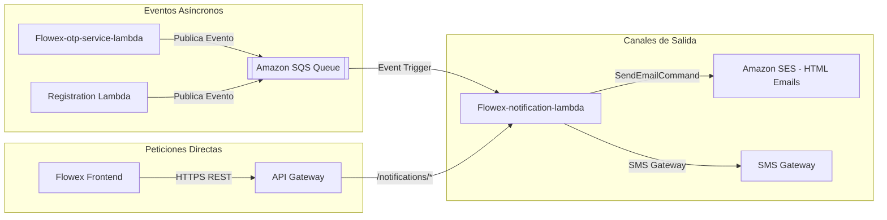

# Notificaciones Transaccionales y Amazon SES (Notifications)

El microservicio `Flowex-notification-lambda` centraliza las comunicaciones salientes de la plataforma, despachando correos electrónicos con plantillas HTML responsivas mediante **Amazon SES** (Simple Email Service), mensajes de texto SMS y consumiendo eventos asíncronos desde colas **Amazon SQS**.

---

## 🏗️ Modos de Operación



---

## 📬 Plantillas de Correo Electrónico (Amazon SES)

### 1. Verificación de Cuenta (`/notifications/email/verify-account`)
* **Asunto:** `Flowex: Código para Validación de Cuenta`
* **Contenido:** Contenedor estilizado con el código OTP de 6 dígitos con espacio ampliado (`letter-spacing: 4px`), indicando advertencia de seguridad.

### 2. Bienvenida a la Plataforma (`/notifications/email/welcome`)
* **Asunto:** `Flowex: ¡Bienvenido a nuestra plataforma!`
* **Contenido:** Saludo personalizado indicando el rol activado (`cliente` o `conductor`) y botón de acción directo hacia la pantalla de inicio de sesión (`https://flowex.cl/login`).

### 3. Confirmación de Pedido con PIN de Entrega (`/notifications/email/order-created`)
* **Asunto:** `Flowex: Confirmación de Pedido {trackingNumber}`
* **Contenido:** Detalle del despacho, número de seguimiento `FLX-YYYY-XXXX`, monto pagado y el **Código de Seguridad de 4 dígitos (PIN)** que el destinatario debe entregar al conductor al momento de la recepción.

### 4. Actualización de Estado de Envío (`/notifications/email/order-status-update`)
* **Asunto:** `Flowex: Estado de tu pedido {trackingNumber} en {ESTADO}`
* **Contenido:** Alerta con el nuevo estado del paquete (`EN TRÁNSITO`, `EN REPARTO`, `ENTREGADO`, `INCIDENCIA`), detalles y botón para seguimiento en vivo en `https://flowex.cl/tracking`.

---

## 📡 Endpoints del Módulo de Notificaciones

### 1. Enviar Correo de Verificación (`POST /notifications/email/verify-account`)
* **Cuerpo de Solicitud:**
```json
{
  "email": "cliente@flowex.cl",
  "name": "Andrea Morales",
  "code": "839201"
}
```
* **Respuesta (`200 OK`):**
```json
{
  "message": "Correo de verificación de cuenta enviado",
  "email": "cliente@flowex.cl",
  "result": {
    "MessageId": "0100017f8a9b2c3d-1a2b3c4d-..."
  }
}
```

---

### 2. Enviar SMS de Verificación (`POST /notifications/sms/verify-phone`)
* **Cuerpo de Solicitud:**
```json
{
  "phone": "+56987654321",
  "code": "839201"
}
```
* **Respuesta (`200 OK`):**
```json
{
  "message": "Mensaje SMS de verificación enviado",
  "phone": "+56987654321",
  "result": {
    "status": "mock_sms_sent",
    "phone": "+56987654321",
    "sentAt": "2026-08-19T10:40:00.000Z"
  }
}
```

---

### 3. Enviar Correo de Bienvenida (`POST /notifications/email/welcome`)
* **Cuerpo de Solicitud:**
```json
{
  "email": "cliente@flowex.cl",
  "name": "Andrea Morales",
  "role": "client"
}
```
* **Respuesta (`200 OK`):**
```json
{
  "message": "Correo de bienvenida enviado",
  "email": "cliente@flowex.cl"
}
```

---

### 4. Enviar Confirmación de Envío y PIN (`POST /notifications/email/order-created`)
* **Cuerpo de Solicitud:**
```json
{
  "email": "destinatario@gmail.com",
  "recipientName": "María López",
  "trackingNumber": "FLX-2026-8492",
  "deliveryCode": "4920",
  "totalCost": 14500
}
```
* **Respuesta (`200 OK`):**
```json
{
  "message": "Correo de confirmación de pedido enviado",
  "email": "destinatario@gmail.com"
}
```

---

### 5. Enviar Actualización de Estado (`POST /notifications/email/order-status-update`)
* **Cuerpo de Solicitud:**
```json
{
  "email": "destinatario@gmail.com",
  "recipientName": "María López",
  "trackingNumber": "FLX-2026-8492",
  "newStatus": "transit",
  "details": "El conductor asignado ha retirado el paquete y se encuentra en ruta hacia su domicilio"
}
```
* **Respuesta (`200 OK`):**
```json
{
  "message": "Correo de actualización de estado enviado",
  "email": "destinatario@gmail.com"
}
```
