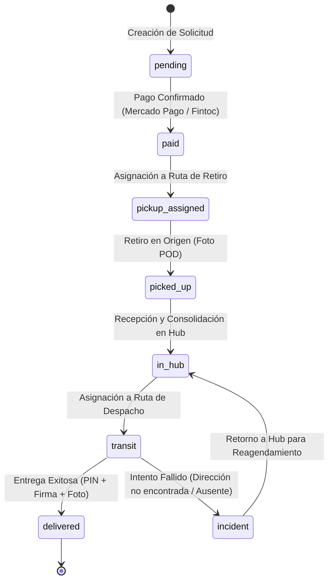
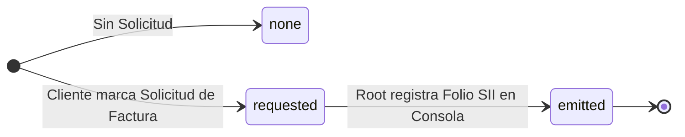

# Gestión de Pedidos, Rutas y Proof of Delivery (POD)

El motor logístico de Flowex orquesta el ciclo de vida completo de cada despacho desde su cotización y pago hasta su entrega final, implementando mecanismos de seguridad como **códigos PIN de 4 dígitos** y **Proof of Delivery (POD)** con firma digital y evidencia fotográfica.

---

## 📦 Ciclo de Vida del Envío (`OrderStatus`)



---

## 🔒 Mecanismos de Seguridad y Validación de Entrega

### 1. Número de Tracking Único (`trackingNumber`)
* Formato: `FLX-YYYY-XXXX` (ejemplo: `FLX-2026-8492`).
* Permite el seguimiento público en tiempo real mediante la interfaz de tracking sin requerir inicio de sesión.

### 2. PIN de Seguridad de Entrega (`deliveryCode`)
* Al confirmarse el pago, el sistema genera automáticamente un **código de seguridad de 4 dígitos**.
* Este código se envía de forma confidencial al cliente/destinatario por correo electrónico y WhatsApp.
* **Regla estricta:** El conductor no puede marcar una orden como `delivered` sin ingresar el PIN correcto proporcionado por el receptor en mano.

### 3. Proof of Delivery (POD) Completo
Para garantizar la trazabilidad legal y operativa de la entrega, se capturan tres evidencias obligatorias:
1. **Validación del PIN de 4 dígitos** (`deliveryCode`).
2. **Firma Digital del Receptor** (Vector en base64 / canvas touch).
3. **Fotografía del Paquete Entregado** (Capturada desde la cámara del dispositivo móvil del chofer).
4. **Coordenadas GPS y Marca de Tiempo** (`deliveryTimestamp`).

---

## 🗺️ Generación de Rutas y Asignación de Choferes

El sistema genera cada día **N rutas dinámicas** en torno a los conductores en turno y a la
capacidad de sus vehículos. El algoritmo completo, el contrato de los endpoints y el modelo
de flota están en [Planificación de Rutas y Flota](/route-planning).

| Tipo de Ruta | Código | Objetivo |
| :--- | :--- | :--- |
| `pickup` | `RUT-REC-YYYYMMDD-NNN` | Recolección en domicilios o bodegas de remitentes |
| `delivery` | `RUT-ENT-YYYYMMDD-NNN` | Distribución y entrega a destinatarios finales |

Cada ruta es de un solo tipo. Un conductor puede recibir una ruta de recogida encadenada
detrás de una de entrega en la misma zona si su jornada lo permite.

### Estados de la Ruta (`RouteStatus`)
* `draft`: Borrador.
* `generated`: Lista para asignación.
* `planned`: Generada por el corte diario y persistida.
* `assigned`: Asignada a un conductor y vehículo con patente.
* `in_transit`: Conductor en recorrido activo.
* `completed`: Todos los paquetes entregados o procesados con estado final.
* `cancelled`: Anulada antes de iniciarse.

### `stopSequence`: el orden de las paradas

Cada pedido dentro de una ruta lleva `stopSequence`, la posición de visita que devolvió el
optimizador, empezando en 1.

**La interfaz debe numerar y ordenar por este campo, nunca por el índice del arreglo.** Los
kilómetros y el tiempo estimado de la ruta corresponden a esta secuencia; presentar las
paradas en otro orden describe un viaje distinto del que se midió.

### `estimateSource`: de dónde salen los números

| Valor | Significado |
| :--- | :--- |
| `google` | Directions entregó la secuencia y la distancia. Ambas describen el mismo recorrido. |
| `fallback` | Google no respondió. El orden es una heurística de vecino más cercano y la distancia una estimación propia. |

La lista de paradas solo puede rotularse como "optimizada" cuando vale `google`. Cuando vale
`fallback` la interfaz lo señala explícitamente en lugar de presentar la estimación como si
viniera de Google.

### Chunking de waypoints

Directions admite 25 waypoints por llamada. Sobre 23 paradas intermedias la petición se
parte en tramos encadenados y las distancias se suman, en vez de emitir números inventados
al recibir `MAX_WAYPOINTS_EXCEEDED`. La optimización queda local a cada tramo.

### Carga por pedido

`estimatedWeightKg` y `estimatedVolumeM3` se derivan del catálogo de tarifas: cada bulto
aporta el tope de peso de su categoría y el volumen de su caja nominal. Son cotas superiores
declaradas, no mediciones, y `loadSource` lo deja explícito con el valor `tariff_estimate`.

---

## 📝 Estructura de la Entidad Orden (`Order`)

```typescript
export interface Order {
  id: string;
  trackingNumber: string;
  enteredBy: 'cliente' | 'vendedor';
  
  // Remitente (Origen Dinámico)
  senderName: string;
  senderPhone: string;
  senderEmail: string;
  senderAddress: string;
  senderCommune: string;
  senderRegion?: string;

  // Destinatario (Destino Dinámico)
  recipientName: string;
  recipientPhone: string;
  recipientEmail: string;
  recipientAddress: string;
  recipientCommune: string;
  recipientRegion?: string;

  // Paquete
  packagesCount: number;
  packageType: string;
  weightKg: number;
  declaredValue: number;
  insuranceCost: number;
  shippingType: 'normal' | 'express' | 'same_day';
  zone: string;
  hubName: string;

  // Estados & Pagos
  status: OrderStatus;
  isPaid: boolean;
  paymentMethod: 'mercadopago' | 'fintoc' | 'webpay' | 'transfer';
  paymentTransactionId?: string;
  paidAt?: string;

  // Seguridad & Evidencias POD
  deliveryCode: string; // PIN de 4 dígitos
  pickupPhotoUrl?: string;
  pickupTimestamp?: string;
  deliveryPhotoUrl?: string;
  deliverySignature?: string;
  deliveryTimestamp?: string;
  failedDeliveryReason?: string;

  // Costos y Fechas
  baseCost: number;
  totalCost: number;
  createdAt: string;
  estimatedDelivery: string;
  eventLogs: EventLog[];
}
```

---

## 📡 Creación Dinámica de Envíos (`POST /orders`)

> [!NOTE]
> **Modelo de Direcciones Dinámicas:**
> Flowex no exige una dirección domiciliaria fija en el registro de cliente. Cada despacho especifica de manera individual sus direcciones de retiro (origen) y entrega (destino) en el cuerpo de la solicitud de `POST /orders`.

### Ejemplo de Solicitud (`POST /orders`)

```json
{
  "enteredBy": "cliente",
  "senderName": "Juan Pérez Silva",
  "senderPhone": "+56991234567",
  "senderEmail": "juan.cliente@gmail.com",
  "senderAddress": "Av. Providencia 1234, Of. 502",
  "senderCommune": "Providencia",
  "senderRegion": "Región Metropolitana",
  "recipientName": "María López González",
  "recipientPhone": "+56987654321",
  "recipientEmail": "maria.destinatario@gmail.com",
  "recipientAddress": "Av. Las Condes 10200, Depto 401",
  "recipientCommune": "Las Condes",
  "recipientRegion": "Región Metropolitana",
  "packagesCount": 1,
  "packageType": "caja_mediana",
  "weightKg": 2.5,
  "declaredValue": 45000,
  "shippingType": "express"
}
```

### Respuesta Exitosa (`201 Created`)

```json
{
  "message": "Orden creada exitosamente. Pendiente de pago.",
  "order": {
    "id": "ord_1771344928000",
    "trackingNumber": "FLX-2026-8492",
    "status": "pending",
    "isPaid": false,
    "totalCost": 8900,
    "createdAt": "2026-08-24T14:35:00.000Z"
  }
}
```

---

## 🏷️ Sistema de Etiquetas de Despacho y Bultos Multi-Paquete (Shipping Labels)

Flowex provee generación e impresión directa de etiquetas logísticas estándar optimizadas para impresoras térmicas adhesivas (**100 mm x 150 mm / 4" x 6"**) o papel común A4/Carta.

### 1. Fraccionamiento Multi-Bulto (`1/N`)
Cuando un pedido se ingresa con múltiples bultos (`packagesCount > 1`), el motor emite una etiqueta única por cada bulto con la numeración secuencial explícita:
* **`1/3`**: Bulto 1 de 3.
* **`2/3`**: Bulto 2 de 3.
* **`3/3`**: Bulto 3 de 3.
* **`1/1`**: Bulto unitario único.

Esto permite a conductores en ruta y operadores en el **Hub Central Quilicura** verificar que el lote viaje íntegro antes de la carga en vehículo o entrega final.

### 2. Estructura de la Etiqueta
Cada etiqueta incluye:
* **Cabecera**: Logotipo Flowex y contador de bulto (`X/N`).
* **Código de Barras Code-128 (SVG)**: Renderizado vectorial sin dependencias externas para escaneo nítido con pistolas láser o cámaras móviles.
* **Datos del Destinatario**: Nombre completo de quien recibe (`recipientName`), dirección de entrega y comuna destacada en caja de alto contraste.
* **Remitente**: Nombre y dirección de origen para devoluciones o trazabilidad.
* **Trazabilidad Operacional**: Hub responsable (`Hub Central Quilicura`), PIN de validación (`deliveryCode`), peso en kg y tipo de servicio.

### 3. Acceso Permanente desde Tablas
* **Mis Envíos (Cliente)**: Botón con icono `Printer` en la columna *Acciones* de `CustomerOrdersPage`.
* **Gestión Central & Bodega (Admin)**: Botón `Etiqueta` disponible en la tabla general de pedidos y en la bandeja de pedidos pendientes de recogida de `AdminDashboardPage`.

---

## 🧾 Solicitud y Gestión de Facturación Electrónica (DTE)

Flowex incorpora un flujo operacional para la gestión de documentos tributarios electrónicos (DTE - Factura Afecta con 19% IVA), permitiendo a empresas solicitar factura al momento de registrar despachos y a los administradores (**`root`**) tramitar y registrar el **Folio oficial del SII**.

### 1. Solicitud por el Cliente (Tarjeta Final)
En la sección final de confirmación de envíos (`CreateOrderPage`), el remitente puede marcar la casilla **"Solicitar Factura Electrónica (DTE)"**:
* **Desglose Tributario Automático**:
  $$\text{Neto} = \text{round}\left(\frac{\text{Total}}{1.19}\right)$$
  $$\text{IVA (19\%)} = \text{Total} - \text{Neto}$$
* **Datos Fiscales Requeridos**:
  * **RUT Empresa**: Validación estricta con algoritmo chileno Módulo 11 (formato `XX.XXX.XXX-K`).
  * **Razón Social**: Nombre legal de la empresa.
  * **Giro Comercial**: Actividad económica registrada en el SII.
  * **Correo DTE**: Casilla electrónica habilitada para recepción de XML/PDF del SII.
  * **Dirección Tributaria**: Domicilio fiscal registrado.
* **Autocompletado desde Perfil**: Si la cuenta cuenta con datos en `user.billingInfo`, el formulario precarga la información con opción de restauración en un clic.

### 2. Estados de Facturación (`InvoiceStatus`)



* **`none`**: Pedido estándar sin requerimiento de factura empresarial.
* **`requested`**: Solicitud registrada; pedido marcado con insignia amarilla 🟡 `🧾 Factura Solicitada`.
* **`emitted`**: Documento emitido en SII; pedido marcado con insignia verde 🟢 `🧾 Factura #FOLIO`.

### 3. Consola Operativa para Superusuario (`root`)
En la Consola de Operaciones (`AdminDashboardPage`):
* **Filtros Dedicados**: En el selector de estados se incluyen los filtros `🧾 Facturas Pendientes (Solicitadas)` y `🧾 Facturas Emitidas (Folio SII)`.
* **Búsqueda Integrada**: La barra de búsqueda filtra instantáneamente por RUT de empresa, Razón Social o Folio SII.
* **Modal de Gestión DTE (`InvoiceManagementModal`)**:
  * Visualización de montos (Neto, IVA 19%, Total).
  * Botones de copiado rápido (`Copy`) de RUT, Razón Social, Giro y Correo para agilizar el ingreso en el portal de facturación del SII o ERP.
  * Campo para registrar el **Folio SII** oficial otorgado por la autoridad tributaria.
  * Trazabilidad en la bitácora de auditoría (`eventLogs`) con marca de tiempo y rol del operador.

### 4. Transparencia para el Cliente
* **Mis Envíos (`CustomerOrdersPage`)**: La columna de costo muestra la etiqueta de estado de la factura. Al abrir el modal de detalles, se expone el desglose de Neto + IVA y el número de Folio oficial registrado.
* **Pasarela de Checkout (`CheckoutPage`)**: El resumen lateral detalla la solicitud de factura electrónica DTE adjunta al despacho.


