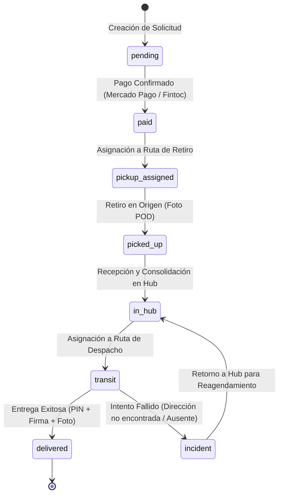

# Gestión de Pedidos, Rutas y Proof of Delivery (POD)

El motor logístico de Flowex orquesta el ciclo de vida completo de cada despacho desde su cotización y pago hasta su entrega final, implementando mecanismos de seguridad como **códigos PIN de 4 dígitos** y **Proof of Delivery (POD)** con firma digital y evidencia fotográfica.

---

## 📦 Ciclo de Vida del Envío (`OrderStatus`)



---

## 🔒 Mecanismos de Seguridad y Validación de Entrega

### 1. Número de Tracking Único (`trackingNumber`)
* Formato: `FLX-YYYY-XXXX` (ejemplo: `FLX-2026-8492`).
* Permite el seguimiento público en tiempo real mediante la interfaz de tracking sin requerir inicio de sesión.

### 2. PIN de Seguridad de Entrega (`deliveryCode`)
* Al confirmarse el pago, el sistema genera automáticamente un **código de seguridad de 4 dígitos**.
* Este código se envía de forma confidencial al cliente/destinatario por correo electrónico y WhatsApp.
* **Regla estricta:** El conductor no puede marcar una orden como `delivered` sin ingresar el PIN correcto proporcionado por el receptor en mano.

### 3. Proof of Delivery (POD) Completo
Para garantizar la trazabilidad legal y operativa de la entrega, se capturan tres evidencias obligatorias:
1. **Validación del PIN de 4 dígitos** (`deliveryCode`).
2. **Firma Digital del Receptor** (Vector en base64 / canvas touch).
3. **Fotografía del Paquete Entregado** (Capturada desde la cámara del dispositivo móvil del chofer).
4. **Coordenadas GPS y Marca de Tiempo** (`deliveryTimestamp`).

---

## 🗺️ Generación de Rutas y Asignación de Choferes

El sistema agrupa automáticamente los pedidos en dos tipos de rutas logísticas:

| Tipo de Ruta | Código | Comunas y Zonas | Objetivo |
| :--- | :--- | :--- | :--- |
| `pickup` | `RUT-REC-XXX` | Santiago Centro, Providencia, Las Condes | Recolección de paquetes en domicilios o bodegas de remitentes |
| `delivery` | `RUT-DES-XXX` | Maipú, Pudahuel, Quilicura, San Bernardo | Distribución y entrega a domicilio a destinatarios finales |

### Estados de la Ruta (`RouteStatus`)
* `draft`: Ruta generada automáticamente por optimizador de zona.
* `generated`: Lista para asignación.
* `assigned`: Asignada a un conductor y vehículo con patente.
* `in_transit`: Conductor en recorrido activo.
* `completed`: Todos los paquetes entregados o procesados con estado final.

---

## 📝 Estructura de la Entidad Orden (`Order`)

```typescript
export interface Order {
  id: string;
  trackingNumber: string;
  enteredBy: 'cliente' | 'vendedor';
  
  // Remitente (Origen Dinámico)
  senderName: string;
  senderPhone: string;
  senderEmail: string;
  senderAddress: string;
  senderCommune: string;
  senderRegion?: string;

  // Destinatario (Destino Dinámico)
  recipientName: string;
  recipientPhone: string;
  recipientEmail: string;
  recipientAddress: string;
  recipientCommune: string;
  recipientRegion?: string;

  // Paquete
  packagesCount: number;
  packageType: string;
  weightKg: number;
  declaredValue: number;
  insuranceCost: number;
  shippingType: 'normal' | 'express' | 'same_day';
  zone: string;
  hubName: string;

  // Estados & Pagos
  status: OrderStatus;
  isPaid: boolean;
  paymentMethod: 'mercadopago' | 'fintoc' | 'webpay' | 'transfer';
  paymentTransactionId?: string;
  paidAt?: string;

  // Seguridad & Evidencias POD
  deliveryCode: string; // PIN de 4 dígitos
  pickupPhotoUrl?: string;
  pickupTimestamp?: string;
  deliveryPhotoUrl?: string;
  deliverySignature?: string;
  deliveryTimestamp?: string;
  failedDeliveryReason?: string;

  // Costos y Fechas
  baseCost: number;
  totalCost: number;
  createdAt: string;
  estimatedDelivery: string;
  eventLogs: EventLog[];
}
```

---

## 📡 Creación Dinámica de Envíos (`POST /orders`)

> [!NOTE]
> **Modelo de Direcciones Dinámicas:**
> Flowex no exige una dirección domiciliaria fija en el registro de cliente. Cada despacho especifica de manera individual sus direcciones de retiro (origen) y entrega (destino) en el cuerpo de la solicitud de `POST /orders`.

### Ejemplo de Solicitud (`POST /orders`)

```json
{
  "enteredBy": "cliente",
  "senderName": "Juan Pérez Silva",
  "senderPhone": "+56991234567",
  "senderEmail": "juan.cliente@gmail.com",
  "senderAddress": "Av. Providencia 1234, Of. 502",
  "senderCommune": "Providencia",
  "senderRegion": "Región Metropolitana",
  "recipientName": "María López González",
  "recipientPhone": "+56987654321",
  "recipientEmail": "maria.destinatario@gmail.com",
  "recipientAddress": "Av. Las Condes 10200, Depto 401",
  "recipientCommune": "Las Condes",
  "recipientRegion": "Región Metropolitana",
  "packagesCount": 1,
  "packageType": "caja_mediana",
  "weightKg": 2.5,
  "declaredValue": 45000,
  "shippingType": "express"
}
```

### Respuesta Exitosa (`201 Created`)

```json
{
  "message": "Orden creada exitosamente. Pendiente de pago.",
  "order": {
    "id": "ord_1771344928000",
    "trackingNumber": "FLX-2026-8492",
    "status": "pending",
    "isPaid": false,
    "totalCost": 8900,
    "createdAt": "2026-08-24T14:35:00.000Z"
  }
}
```

