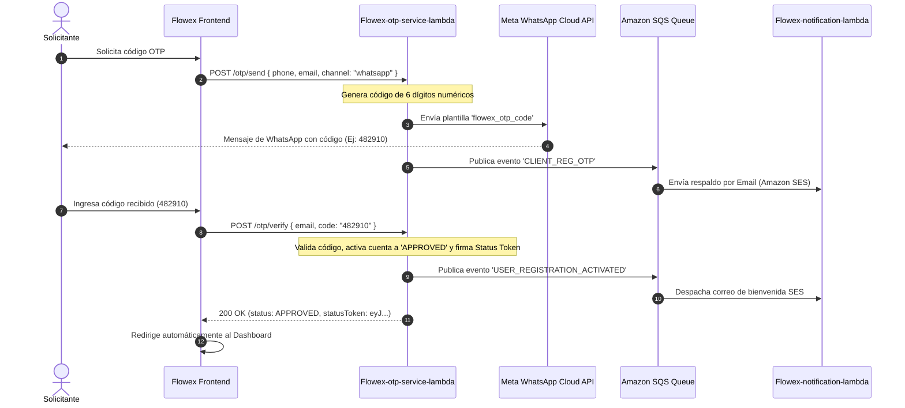

# Motor OTP y Meta WhatsApp Business Cloud API

El microservicio `Flowex-otp-service-lambda` gestiona la emisión, envío multicanal y verificación de contraseñas de un solo uso (**One-Time Passwords / OTP**) de 6 dígitos, integrando directamente la API oficial en la nube de WhatsApp de Meta (Graph API v19.0).

---

## 📱 Integración con Meta WhatsApp Cloud API

Para envíos a números móviles en Chile, el servicio normaliza automáticamente los prefijos telefónicos:
* Formato internacional: `+56 9 8765 4321` $\rightarrow$ `56987654321`.

### Endpoint de Meta Graph API
```http
POST https://graph.facebook.com/v19.0/{WHATSAPP_PHONE_NUMBER_ID}/messages
Authorization: Bearer {WHATSAPP_API_TOKEN}
Content-Type: application/json
```

### Plantillas Oficiales de WhatsApp Utilizadas

| Plantilla | Propósito | Variables Dinámicas |
| :--- | :--- | :--- |
| `flowex_otp_code` | Envío de código OTP de 6 dígitos | `{{1}}` (Código OTP) |
| `flowex_order_created` | Confirmación de nuevo pedido registrado | `{{1}}` (Tracking), `{{2}}` (PIN de entrega) |
| `flowex_order_in_transit` | Notificación de envío en ruta | `{{1}}` (Tracking), `{{2}}` (Nombre Chofer) |
| `flowex_order_delivered` | Confirmación de entrega exitosa | `{{1}}` (Tracking), `{{2}}` (Receptor) |
| `flowex_delivery_incident` | Notificación de problema en entrega | `{{1}}` (Tracking), `{{2}}` (Motivo) |

---

## 🔄 Flujo de Verificación y Auto-Activación de Cuenta



---

## 📡 Endpoints del Módulo OTP

### 1. Enviar OTP Multicanal (`POST /otp/send`)
Genera y despacha el código por SMS, WhatsApp, Email o ambos.

* **Cuerpo de Solicitud:**
```json
{
  "email": "cliente@flowex.cl",
  "phone": "+56991234567",
  "channel": "whatsapp"
}
```
* **Respuesta Exitosa (`200 OK`):**
```json
{
  "message": "OTP generado y enviado por SMS/WhatsApp/Email correctamente",
  "email": "cliente@flowex.cl",
  "phone": "+56991234567",
  "channel": "whatsapp",
  "mockOtpCode": "482910"
}
```

---

### 2. Enviar OTP Exclusivo WhatsApp (`POST /otp/send-whatsapp`)
Llamada optimizada para envíos directos mediante Meta Cloud API.

* **Cuerpo de Solicitud:**
```json
{
  "phone": "+56987654321"
}
```
* **Respuesta Exitosa (`200 OK`):**
```json
{
  "message": "Código OTP enviado por WhatsApp exitosamente",
  "phone": "+56987654321",
  "channel": "whatsapp",
  "otp": "654321",
  "whatsappResponse": {
    "status": "sent",
    "messageId": "wamid.HBgLMNTY5ODc2NTQzMjEVAgARGBIwRjN...",
    "to": "56987654321",
    "template": "flowex_otp_code"
  }
}
```

---

### 3. Verificar OTP y Auto-Activar Cuenta (`POST /otp/verify`)
Valida el código de 6 dígitos ingresado por el usuario. Al validar correctamente, la cuenta pasa inmediatamente a estado `APPROVED` y se emite un **Status Token**.

* **Cuerpo de Solicitud:**
```json
{
  "email": "cliente@flowex.cl",
  "code": "482910"
}
```
* **Respuesta Exitosa (`200 OK`):**
```json
{
  "message": "Información validada por OTP. Registro aprobado y cuenta activada exitosamente.",
  "status": "APPROVED",
  "account": {
    "email": "cliente@flowex.cl",
    "status": "APPROVED",
    "isActive": true,
    "is_verified": true,
    "is_email_verified": true,
    "is_phone_verified": true,
    "activatedAt": "2026-08-19T10:30:00.000Z"
  },
  "statusToken": "eyJwYXlsb2FkIjoie1wiZW1haWxcIjpcImNsaWVudGVAZmxvd2V4LmNsXCIsXCJleHBpcmVzQXRcIjoxNzcxNDMwNDAwMDAwLFwicHVycG9zZVwiOlwic3RhdHVzX2FjY2Vzc1wifSIsImhtYWMiOiIzOGIzYTI..."
}
```

---

### 4. Despachar Plantillas de WhatsApp (`POST /notifications/whatsapp`)
Permite enviar notificaciones logísticas personalizadas a los clientes destinatarios.

* **Cuerpo de Solicitud:**
```json
{
  "phone": "+56991234567",
  "notificationType": "ORDER_CREATED",
  "parameters": [
    "FLX-2026-8492",
    "4920"
  ]
}
```
* **Respuesta (`200 OK`):**
```json
{
  "message": "Notificación de WhatsApp enviada correctamente",
  "phone": "+56991234567",
  "notificationType": "ORDER_CREATED",
  "templateName": "flowex_order_created",
  "whatsappResponse": {
    "status": "sent"
  }
}
```
