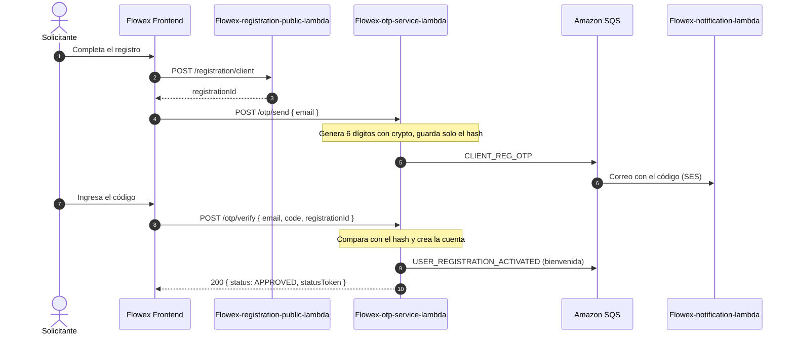

# Códigos de verificación y WhatsApp Business

El microservicio `Flowex-otp-service-lambda` hace dos cosas distintas, con canales distintos:

| Qué | Canal | Rutas |
| :--- | :--- | :--- |
| **Código de verificación** (registro, invitaciones) | **Solo correo** (Amazon SES vía la cola de notificaciones) | `POST /otp/send`, `POST /otp/verify`, `GET /otp/deliveries`, `POST /otp/deliveries/{deliveryId}/resend` |
| **Avisos del pedido** y **código de entrega** al destinatario | Meta WhatsApp Cloud API | `POST /notifications/whatsapp`, `POST /otp/send-delivery-code` |

> [!IMPORTANT]
> El código de verificación tiene **un único canal: el correo**. `POST /otp/send` ignora un
> `phone` o un `channel: "whatsapp"` en el cuerpo, y sin correo responde `400`. La antigua
> ruta `POST /otp/send-whatsapp` ya no existe, y Flowex no envía SMS.

---

## 🔄 Verificación del correo y activación de la cuenta



* El código vence a los **10 minutos** y admite **5 intentos**.
* Por destinatario se pueden pedir **5 códigos cada 15 minutos**; después responde `429`.
* Fuera de producción, y solo con activación explícita, la respuesta de `/otp/send` trae
  `devOtpCode` para probar el registro sin revisar el correo. En producción ese campo no existe.

---

## 📡 Endpoints

### 1. Enviar el código (`POST /otp/send`)

```json
{ "email": "cliente@flowex.cl" }
```

Respuesta (`200 OK`). `delivered` dice si el correo salió de verdad; si el proveedor falla
responde `200` con `delivered: false` y `success: false`, no un `5xx`:

```json
{
  "success": true,
  "message": "Código enviado. Vence en 10 minutos.",
  "deliveryId": "otp_1771344928000",
  "email": "cliente@flowex.cl",
  "channel": "email",
  "delivered": true,
  "error": null
}
```

### 2. Verificar el código (`POST /otp/verify`)

```json
{ "email": "cliente@flowex.cl", "code": "482910", "registrationId": "reg_1771344928000" }
```

* Sin `registrationId` solo confirma el código: `{ "status": "VERIFIED", "verified": true, "statusToken": "…" }`.
* Con `registrationId` crea la cuenta en ese momento:

```json
{
  "message": "Correo verificado. Tu cuenta quedó activa.",
  "status": "APPROVED",
  "account": {
    "userId": "3c3c3c3c-1111-4222-8333-444455556666",
    "email": "cliente@flowex.cl",
    "role": "client",
    "status": "APPROVED",
    "isActive": true,
    "is_email_verified": true
  },
  "statusToken": "eyJ…"
}
```

Errores: `401` código incorrecto, `410` código vencido o solicitud que ya no está vigente,
`409` invitación ya usada o correo/RUT ya registrado.

### 3. Historial de envíos (`GET /otp/deliveries`)

Para operaciones (`root`, `admin`): qué códigos se emitieron y cuáles no llegaron. Los
contactos van enmascarados y el código nunca se guarda en claro.

* Query: `page` (desde 1), `limit` (máx. 100), `q` (correo o dígitos del teléfono).

```json
{
  "success": true,
  "data": [
    {
      "id": "otp_1771344928000",
      "identifier": "c***@flowex.cl",
      "email": "c***@flowex.cl",
      "phone": null,
      "channel": "email",
      "status": "entregado",
      "sendCount": 1,
      "verifyAttempts": 1,
      "expiresAt": "2026-09-21T10:40:00.000Z",
      "consumedAt": "2026-09-21T10:32:15.000Z",
      "resentBy": null,
      "vigente": false
    }
  ],
  "meta": { "total": 88, "page": 1, "limit": 20, "last_page": 5 },
  "fallidos": 0,
  "ttlMinutos": 10,
  "intentosMaximos": 5
}
```

Los envíos antiguos pueden mostrar `channel: "whatsapp"`: son de antes de que el correo
fuera el único canal.

### 4. Reenviar un código (`POST /otp/deliveries/{deliveryId}/resend`)

Operaciones emite un código nuevo para el mismo correo (el anterior se guardó con hash y no
se puede releer). Si el envío original no tiene correo responde `409`.

---

## 📱 WhatsApp: avisos del pedido

### Plantillas

| Tipo (`notificationType`) | Plantilla | Uso |
| :--- | :--- | :--- |
| `ORDER_CREATED` | `flowex_order_created_v2` | Pedido registrado, con PIN de entrega, razón social del remitente e imagen de cabecera |
| `ORDER_OUT_TODAY` | `flowex_order_out_today` | El pedido sale hoy a reparto |
| `ORDER_NEXT_STOP` | `flowex_order_next_stop` | El destinatario es la siguiente parada |
| `ORDER_IN_TRANSIT` | `flowex_order_in_transit` | En tránsito |
| `ORDER_DELIVERED` | `flowex_order_delivered` | Entregado |
| `DELIVERY_INCIDENT` | `flowex_delivery_incident` | Incidencia en la entrega |
| (otro) | `flowex_general_notification` | Respaldo de utilidad |

### `POST /notifications/whatsapp`

Requiere sesión. API Gateway entrega esta ruta a `otp-service`, no a `notification-lambda`.

```json
{
  "phone": "+56991234567",
  "notificationType": "ORDER_OUT_TODAY",
  "parameters": ["FLX-2026-8492", "Carla Conductora", "María", "4920"]
}
```

```json
{
  "message": "Notificación de WhatsApp enviada correctamente",
  "notificationType": "ORDER_OUT_TODAY",
  "templateName": "flowex_order_out_today",
  "delivered": true,
  "whatsappResponse": { "messages": [{ "id": "wamid.…" }] }
}
```

> [!WARNING]
> Sin credenciales de Meta **no sale ningún mensaje**, y la respuesta lo dice:
> `delivered: false` y `whatsappResponse.status: "not_sent"`. Antes respondía `mock_sent`
> con un id inventado y se contaba como entregado.

### `POST /otp/send-delivery-code`

Solo operaciones (`root`, `admin`, `driver`): envía al destinatario el código de entrega
del pedido por WhatsApp. El texto es el canónico del servicio, no el del cuerpo.
