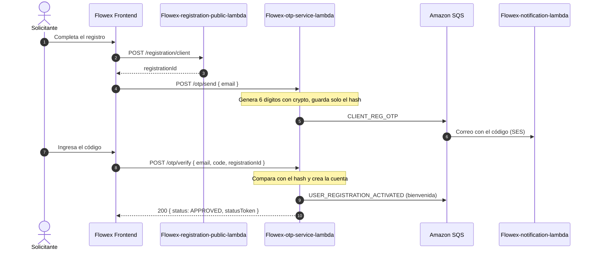

# Códigos de verificación y WhatsApp Business

El microservicio `Flowex-otp-service-lambda` hace dos cosas distintas, con canales distintos:

| Qué | Canal | Rutas |
| :--- | :--- | :--- |
| **Código de verificación** (registro, invitaciones) | **Solo correo** (Amazon SES vía la cola de notificaciones) | `POST /otp/send`, `POST /otp/verify`, `GET /otp/deliveries`, `POST /otp/deliveries/{deliveryId}/resend` |
| **Avisos del pedido** y **código de entrega** al destinatario | Meta WhatsApp Cloud API | `POST /notifications/whatsapp`, `GET /internal/orders/delivery-codes`, `POST /internal/orders/{orderId}/delivery-code/resend`, `POST /internal/orders/{orderId}/delivery-code/reissue` |

> [!IMPORTANT]
> El código de verificación tiene **un único canal: el correo**. `POST /otp/send` ignora un
> `phone` o un `channel: "whatsapp"` en el cuerpo, y sin correo responde `400`. La antigua
> ruta `POST /otp/send-whatsapp` ya no existe, y Flowex no envía SMS.

---

## 🔄 Verificación del correo y activación de la cuenta


```mermaid
sequenceDiagram
    autonumber
    actor Usuario as Solicitante
    participant Frontend as Flowex Frontend
    participant Registro as Flowex-registration-public-lambda
    participant OTPService as Flowex-otp-service-lambda
    participant SQS as Amazon SQS
    participant NotifWorker as Flowex-notification-lambda

    Usuario->>Frontend: Completa el registro
    Frontend->>Registro: POST /registration/client
    Registro-->>Frontend: registrationId
    Frontend->>OTPService: POST /otp/send { email }
    Note over OTPService: Genera 6 dígitos con crypto, guarda solo el hash
    OTPService->>SQS: CLIENT_REG_OTP
    SQS->>NotifWorker: Correo con el código (SES)
    Usuario->>Frontend: Ingresa el código
    Frontend->>OTPService: POST /otp/verify { email, code, registrationId }
    Note over OTPService: Compara con el hash y crea la cuenta
    OTPService->>SQS: USER_REGISTRATION_ACTIVATED (bienvenida)
    OTPService-->>Frontend: 200 { status: APPROVED, statusToken }
```

* El código vence a los **10 minutos** y admite **5 intentos**.
* Por destinatario se pueden pedir **5 códigos cada 15 minutos**; después responde `429`.
* Fuera de producción, y solo con activación explícita, la respuesta de `/otp/send` trae
  `devOtpCode` para probar el registro sin revisar el correo. En producción ese campo no existe.

---

## 📡 Endpoints

### 1. Enviar el código (`POST /otp/send`)

```json
{ "email": "cliente@flowex.cl" }
```

Respuesta (`200 OK`). `delivered` dice si el correo salió de verdad; si el proveedor falla
responde `200` con `delivered: false` y `success: false`, no un `5xx`:

```json
{
  "success": true,
  "message": "Código enviado. Vence en 10 minutos.",
  "deliveryId": "otp_1771344928000",
  "email": "cliente@flowex.cl",
  "channel": "email",
  "delivered": true,
  "error": null
}
```

### 2. Verificar el código (`POST /otp/verify`)

```json
{ "email": "cliente@flowex.cl", "code": "482910", "registrationId": "reg_1771344928000" }
```

* Sin `registrationId` solo confirma el código: `{ "status": "VERIFIED", "verified": true, "statusToken": "…" }`.
* Con `registrationId` crea la cuenta en ese momento:

```json
{
  "message": "Correo verificado. Tu cuenta quedó activa.",
  "status": "APPROVED",
  "account": {
    "userId": "3c3c3c3c-1111-4222-8333-444455556666",
    "email": "cliente@flowex.cl",
    "role": "client",
    "status": "APPROVED",
    "isActive": true,
    "is_email_verified": true
  },
  "statusToken": "eyJ…"
}
```

Errores: `401` código incorrecto, `410` código vencido o solicitud que ya no está vigente,
`409` invitación ya usada o correo/RUT ya registrado.

### 3. Historial de envíos (`GET /otp/deliveries`)

Para operaciones (`root`, `admin`): qué códigos se emitieron y cuáles no llegaron. Los
contactos van enmascarados y el código nunca se guarda en claro.

* Query: `page` (desde 1), `limit` (máx. 100), `q` (correo o dígitos del teléfono).

```json
{
  "success": true,
  "data": [
    {
      "id": "otp_1771344928000",
      "identifier": "c***@flowex.cl",
      "email": "c***@flowex.cl",
      "phone": null,
      "channel": "email",
      "status": "entregado",
      "sendCount": 1,
      "verifyAttempts": 1,
      "expiresAt": "2026-09-21T10:40:00.000Z",
      "consumedAt": "2026-09-21T10:32:15.000Z",
      "resentBy": null,
      "vigente": false
    }
  ],
  "meta": { "total": 88, "page": 1, "limit": 20, "last_page": 5 },
  "fallidos": 0,
  "ttlMinutos": 10,
  "intentosMaximos": 5
}
```

Los envíos antiguos pueden mostrar `channel: "whatsapp"`: son de antes de que el correo
fuera el único canal.

### 4. Reenviar un código (`POST /otp/deliveries/{deliveryId}/resend`)

Operaciones emite un código nuevo para el mismo correo (el anterior se guardó con hash y no
se puede releer). Si el envío original no tiene correo responde `409`.

---

## 📱 WhatsApp: avisos del pedido

### Plantillas

| Tipo (`notificationType`) | Plantilla | Uso |
| :--- | :--- | :--- |
| `ORDER_CREATED` | `flowex_order_created_v2` | Pedido registrado, con PIN de entrega, razón social del remitente e imagen de cabecera |
| `ORDER_OUT_TODAY` | `flowex_order_out_today` | El pedido sale hoy a reparto |
| `ORDER_NEXT_STOP` | `flowex_order_next_stop` | El destinatario es la siguiente parada |
| `ORDER_IN_TRANSIT` | `flowex_order_in_transit` | En tránsito |
| `ORDER_DELIVERED` | `flowex_order_delivered` | Entregado |
| `DELIVERY_INCIDENT` | `flowex_delivery_incident` | Incidencia en la entrega |
| (otro) | `flowex_general_notification` | Respaldo de utilidad |

### `POST /notifications/whatsapp`

Requiere sesión. API Gateway entrega esta ruta a `otp-service`, no a `notification-lambda`.

```json
{
  "phone": "+56991234567",
  "notificationType": "ORDER_OUT_TODAY",
  "parameters": ["FLX-2026-8492", "Carla Conductora", "María", "4920"]
}
```

```json
{
  "message": "Notificación de WhatsApp enviada correctamente",
  "notificationType": "ORDER_OUT_TODAY",
  "templateName": "flowex_order_out_today",
  "delivered": true,
  "whatsappResponse": { "messages": [{ "id": "wamid.…" }] }
}
```

> [!WARNING]
> Sin credenciales de Meta **no sale ningún mensaje**, y la respuesta lo dice:
> `delivered: false` y `whatsappResponse.status: "not_sent"`. Antes respondía `mock_sent`
> con un id inventado y se contaba como entregado.

### Ruta retirada: `POST /otp/send-delivery-code`

La ruta responde `410 ENDPOINT_RETIRED`: aceptaba teléfonos y PIN arbitrarios del llamador.
El envío operativo ahora se resuelve desde el pedido y el teléfono actual registrado del destinatario.

### Gestión del PIN de entrega

La vista `/admin/otp-deliveries` está reservada a `root` y `admin`. Solo lista pedidos cuyo
estado actual es `out_for_delivery`; los entregados y los pedidos con otros estados no aparecen.
La lista se pagina en servidor con `page` (inicia en 1), `limit` (20 por defecto, máximo 100)
y `q` (seguimiento, nombre del destinatario o dígitos del teléfono). `data` contiene el nombre
de pila y el teléfono enmascarado, nunca el PIN ni el teléfono completo.

#### `GET /internal/orders/delivery-codes`

```json
{
  "success": true,
  "data": [
    {
      "orderId": "8d98802d-45da-47b3-9c91-d710c19d0278",
      "trackingNumber": "FLX-2026-8492",
      "orderStatus": "out_for_delivery",
      "recipientName": "María",
      "recipientPhoneMasked": "•••• 4567",
      "deliveryCodeAvailable": true,
      "deliveryCodeLocked": false,
      "lastResendAt": null,
      "resendStatus": null,
      "resendAllowed": true,
      "resendReason": null,
      "reissueAllowed": true,
      "reissueReason": null
    }
  ],
  "total": 1,
  "meta": { "total": 1, "page": 1, "limit": 20, "last_page": 1 }
}
```

#### `POST /internal/orders/{orderId}/delivery-code/resend`

El cuerpo está vacío. El backend comprueba nuevamente que el pedido siga en `out_for_delivery`,
recupera el PIN vigente desde el almacenamiento cifrado o valida una copia antigua contra el hash,
y obtiene el teléfono del pedido. El PIN no aparece en la respuesta. Se permite un intento por
pedido cada 60 segundos.

`200` significa que Meta aceptó el mensaje; no confirma que el teléfono lo haya recibido.
La respuesta incluye `requestId`, `status: "accepted"` y un mensaje informativo. `401`/`403`
indican sesión o rol no permitido; `404`, pedido inexistente; `409`, estado no elegible, PIN
bloqueado/no recuperable o teléfono inválido; `429`, enfriamiento; `503`, fallo del proveedor
o del servicio de notificaciones.

Los intentos guardan actor, estado, fecha, teléfono enmascarado y el identificador de Meta.
El PIN y el texto enviado no se guardan en la tabla de auditoría ni en la respuesta.

#### `POST /internal/orders/{orderId}/delivery-code/reissue`

También está disponible desde la misma vista la acción **Emitir PIN nuevo**. El cuerpo está vacío.
El servidor genera un PIN aleatorio, invalida el anterior, reinicia los intentos fallidos y lo envía
por WhatsApp al teléfono del pedido. Solo aplica mientras el pedido siga en `out_for_delivery`;
la acción vuelve a comprobar el estado dentro de la transacción. El PIN nuevo nunca se devuelve a
la interfaz.

`200` significa que Meta aceptó el envío. Si Meta no acepta el mensaje, la API devuelve `503`
con `error: "new_pin_issued_send_failed"`: el PIN nuevo ya quedó vigente y el anterior dejó de
servir, por lo que se debe esperar el enfriamiento antes de reintentar. La emisión también reinicia
el bloqueo por intentos y queda auditada con el actor, sin registrar el PIN. Esta acción comparte
el límite de una operación de PIN por pedido cada 60 segundos.
