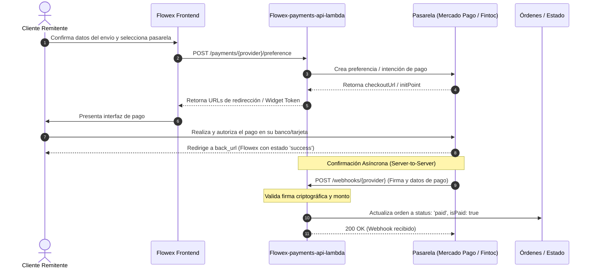

# Pasarelas de Pago y Webhooks (Payments)

Flowex integra dos pasarelas de pago principales para el cobro de fletes y servicios de despacho: **Mercado Pago** (tarjetas de crédito, débito y WebPay Plus) y **Fintoc** (transferencias bancarias instantáneas Account-to-Account mediante Open Banking en Chile).

---

## 💳 Comparativa de Pasarelas

| Característica | Mercado Pago (Checkout Pro) | Fintoc (Open Banking A2A) |
| :--- | :--- | :--- |
| **Métodos Soportados** | WebPay Plus, Tarjetas de Crédito/Débito, Mercado Pago Wallet | Transferencia bancaria directa (Banco de Chile, Santander, BCI, BancoEstado, etc.) |
| **Experiencia de Usuario** | Redirección a pasarela hosted o modal | Modal integrado con credenciales bancarias seguras |
| **Confirmación de Pago** | Notificación IPN / Webhook en segundo plano | Webhook instantáneo con firma HMAC |
| **Moneda** | CLP (Pesos Chilenos) | CLP (Pesos Chilenos) |

---

## 🔄 Flujo Transaccional y Conciliación por Webhooks



---

## 📡 Endpoints del Módulo de Pagos

### 1. Crear Preferencia en Mercado Pago (`POST /payments/mercadopago/preference`)
Genera el identificador de preferencia y las URLs de redirección para Checkout Pro.

* **Cuerpo de Solicitud:**
```json
{
  "orderId": "ord_1771344928",
  "trackingNumber": "FLX-2026-8492",
  "amount": 14500,
  "payerEmail": "cliente@gmail.com",
  "payerName": "Andrea Morales"
}
```

* **Respuesta Exitosa (`200 OK`):**
```json
{
  "provider": "mercadopago",
  "preferenceId": "pref_mp_1771344928000",
  "initPoint": "https://www.mercadopago.cl/checkout/v1/redirect?pref_id=pref_mp_1771344928000",
  "sandboxInitPoint": "https://sandbox.mercadopago.cl/checkout/v1/redirect?pref_id=pref_mp_1771344928000",
  "payload": {
    "items": [
      {
        "id": "ord_1771344928",
        "title": "Envío Flowex Guía FLX-2026-8492",
        "quantity": 1,
        "currency_id": "CLP",
        "unit_price": 14500
      }
    ],
    "payer": {
      "email": "cliente@gmail.com",
      "name": "Andrea Morales"
    },
    "back_urls": {
      "success": "https://flowex.cl/customer/orders?status=success&orderId=ord_1771344928",
      "failure": "https://flowex.cl/customer/orders?status=failure&orderId=ord_1771344928",
      "pending": "https://flowex.cl/customer/orders?status=pending&orderId=ord_1771344928"
    },
    "auto_return": "approved",
    "external_reference": "ord_1771344928",
    "notification_url": "https://api.flowex.cl/webhooks/mercadopago"
  }
}
```

---

### 2. Crear Intención de Pago en Fintoc (`POST /payments/fintoc/payment-intent`)
Genera el `widgetToken` y la URL para inicializar el widget de Open Banking.

* **Cuerpo de Solicitud:**
```json
{
  "orderId": "ord_1771344928",
  "trackingNumber": "FLX-2026-8492",
  "amount": 14500,
  "payerEmail": "cliente@gmail.com"
}
```

* **Respuesta Exitosa (`200 OK`):**
```json
{
  "provider": "fintoc",
  "paymentIntentId": "pi_fintoc_1771344928000",
  "widgetToken": "wt_9a8b7c6d5e4f3a2b1c0d",
  "checkoutUrl": "https://checkout.fintoc.com/p/wt_9a8b7c6d5e4f3a2b1c0d",
  "payload": {
    "amount": 14500,
    "currency": "CLP",
    "recipient_account": {
      "holder_id": "77123456-7",
      "holder_name": "Flowex SpA",
      "number": "12345678",
      "type": "checking_account",
      "bank_id": "cl_banco_de_chile"
    },
    "comment": "Pago Envío Flowex FLX-2026-8492",
    "metadata": {
      "orderId": "ord_1771344928",
      "trackingNumber": "FLX-2026-8492",
      "payerEmail": "cliente@gmail.com"
    }
  }
}
```

---

### 3. Webhook de Notificación Mercado Pago (`POST /webhooks/mercadopago`)
Receptor de notificaciones IPN enviado por los servidores de Mercado Pago tras procesar una transacción.

* **Cuerpo de Solicitud Recibido (`JSON`):**
```json
{
  "action": "payment.created",
  "api_version": "v1",
  "data": {
    "id": "1234567890"
  },
  "date_created": "2026-08-19T10:35:00.000Z",
  "id": 987654321,
  "live_mode": true,
  "type": "payment"
}
```

* **Respuesta (`200 OK`):**
```json
{
  "received": true,
  "provider": "mercadopago",
  "status": "approved",
  "paymentId": "1234567890",
  "orderStatus": "paid",
  "transactionId": "TX-MP-1234567890"
}
```

---

### 4. Webhook de Notificación Fintoc (`POST /webhooks/fintoc`)
Receptor de eventos emitidos por Fintoc tras el éxito o rechazo de una transferencia bancaria A2A.

* **Encabezado Obligatorio:** `x-fintoc-signature: t=...,v1=...`
* **Cuerpo de Solicitud (`payment_intent.succeeded`):**
```json
{
  "id": "evt_123456789",
  "type": "payment_intent.succeeded",
  "data": {
    "id": "pi_fintoc_1771344928000",
    "amount": 14500,
    "currency": "CLP",
    "metadata": {
      "orderId": "ord_1771344928",
      "trackingNumber": "FLX-2026-8492",
      "payerEmail": "cliente@gmail.com"
    }
  }
}
```

* **Respuesta (`200 OK`):**
```json
{
  "received": true,
  "provider": "fintoc",
  "status": "succeeded",
  "orderId": "ord_1771344928",
  "orderStatus": "paid",
  "transactionId": "TX-FINTOC-pi_fintoc_1771344928000"
}
```
