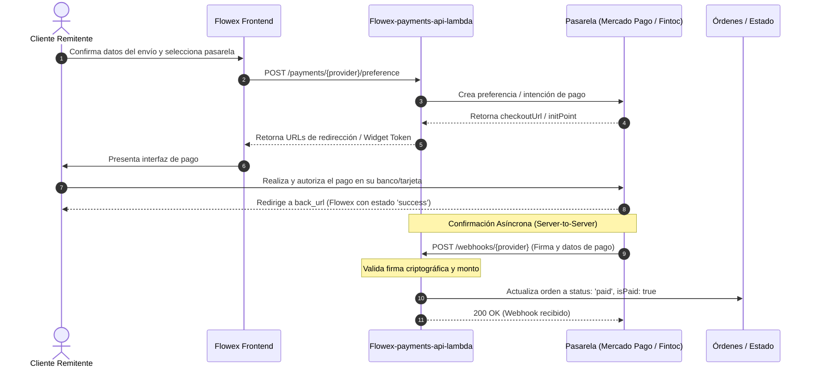

# Pasarelas de Pago y Webhooks (Payments)

Flowex integra dos pasarelas de pago principales para el cobro de fletes y servicios de despacho: **Mercado Pago** (tarjetas de crédito, débito y WebPay Plus) y **Fintoc** (transferencias bancarias instantáneas Account-to-Account mediante Open Banking en Chile).

---

## 💳 Comparativa de Pasarelas

| Característica | Mercado Pago (Checkout Pro) | Fintoc (Open Banking A2A) |
| :--- | :--- | :--- |
| **Métodos Soportados** | WebPay Plus, Tarjetas de Crédito/Débito, Mercado Pago Wallet | Transferencia bancaria directa (Banco de Chile, Santander, BCI, BancoEstado, etc.) |
| **Experiencia de Usuario** | Redirección a pasarela hosted o modal | Modal integrado con credenciales bancarias seguras |
| **Confirmación de Pago** | Notificación IPN / Webhook en segundo plano | Webhook instantáneo con firma HMAC |
| **Moneda** | CLP (Pesos Chilenos) | CLP (Pesos Chilenos) |

---

## 🔄 Flujo Transaccional y Conciliación por Webhooks



---

## 📡 Endpoints del Módulo de Pagos

### 1. Crear Preferencia en Mercado Pago (`POST /payments/mercadopago/preference`)
Genera el identificador de preferencia y las URLs de redirección para Checkout Pro.

* **Cuerpo de Solicitud:**
```json
{
  "orderId": "ord_1771344928",
  "trackingNumber": "FLX-2026-8492",
  "amount": 14500,
  "payerEmail": "cliente@gmail.com",
  "payerName": "Andrea Morales"
}
```

* **Respuesta Exitosa (`200 OK`):**
```json
{
  "provider": "mercadopago",
  "preferenceId": "pref_mp_1771344928000",
  "initPoint": "https://www.mercadopago.cl/checkout/v1/redirect?pref_id=pref_mp_1771344928000",
  "sandboxInitPoint": "https://sandbox.mercadopago.cl/checkout/v1/redirect?pref_id=pref_mp_1771344928000",
  "payload": {
    "items": [
      {
        "id": "ord_1771344928",
        "title": "Envío Flowex Guía FLX-2026-8492",
        "quantity": 1,
        "currency_id": "CLP",
        "unit_price": 14500
      }
    ],
    "payer": {
      "email": "cliente@gmail.com",
      "name": "Andrea Morales"
    },
    "back_urls": {
      "success": "https://flowex.cl/customer/orders?status=success&orderId=ord_1771344928",
      "failure": "https://flowex.cl/customer/orders?status=failure&orderId=ord_1771344928",
      "pending": "https://flowex.cl/customer/orders?status=pending&orderId=ord_1771344928"
    },
    "auto_return": "approved",
    "external_reference": "ord_1771344928",
    "notification_url": "https://api.flowex.cl/webhooks/mercadopago"
  }
}
```

---

### 2. Crear Intención de Pago en Fintoc (`POST /payments/fintoc/payment-intent`)
Genera el `widgetToken` y la URL para inicializar el widget de Open Banking.

* **Cuerpo de Solicitud:**
```json
{
  "orderId": "ord_1771344928",
  "trackingNumber": "FLX-2026-8492",
  "amount": 14500,
  "payerEmail": "cliente@gmail.com"
}
```

* **Respuesta Exitosa (`200 OK`):**
```json
{
  "provider": "fintoc",
  "paymentIntentId": "pi_fintoc_1771344928000",
  "widgetToken": "wt_9a8b7c6d5e4f3a2b1c0d",
  "checkoutUrl": "https://checkout.fintoc.com/p/wt_9a8b7c6d5e4f3a2b1c0d",
  "payload": {
    "amount": 14500,
    "currency": "CLP",
    "recipient_account": {
      "holder_id": "77123456-7",
      "holder_name": "Flowex SpA",
      "number": "12345678",
      "type": "checking_account",
      "bank_id": "cl_banco_de_chile"
    },
    "comment": "Pago Envío Flowex FLX-2026-8492",
    "metadata": {
      "orderId": "ord_1771344928",
      "trackingNumber": "FLX-2026-8492",
      "payerEmail": "cliente@gmail.com"
    }
  }
}
```

---

### 3. Webhook de Notificación Mercado Pago (`POST /webhooks/mercadopago`)
Receptor de notificaciones IPN enviado por los servidores de Mercado Pago tras procesar una transacción. Valida la firma criptográfica HMAC-SHA256 del encabezado `x-signature`.

* **Encabezados Requeridos:** `x-signature`, `x-request-id`
* **Cuerpo de Solicitud Recibido (`JSON`):**
```json
{
  "action": "payment.created",
  "api_version": "v1",
  "data": {
    "id": "1234567890"
  },
  "date_created": "2026-08-19T10:35:00.000Z",
  "id": 987654321,
  "live_mode": true,
  "type": "payment"
}
```

* **Respuesta (`200 OK`):**
```json
{
  "received": true,
  "provider": "mercadopago",
  "status": "approved",
  "paymentId": "1234567890",
  "orderStatus": "paid",
  "transactionId": "TX-MP-1234567890"
}
```

---

### 4. Webhook de Notificación Fintoc (`POST /webhooks/fintoc`)
Receptor de eventos emitidos por Fintoc tras el éxito, rechazo o requerimiento de acción en una transferencia bancaria A2A. Valida la firma HMAC-SHA256 del encabezado `Fintoc-Signature` sobre el cuerpo crudo de la solicitud antes del parseo JSON.

* **Encabezado Obligatorio:** `Fintoc-Signature: t=...,v1=...`
* **Cuerpo de Solicitud (`payment_intent.succeeded`):**
```json
{
  "id": "evt_123456789",
  "type": "payment_intent.succeeded",
  "data": {
    "id": "pi_fintoc_1771344928000",
    "amount": 14500,
    "currency": "CLP",
    "metadata": {
      "orderId": "ord_1771344928",
      "trackingNumber": "FLX-2026-8492",
      "payerEmail": "cliente@gmail.com"
    }
  }
}
```

* **Respuesta (`200 OK`):**
```json
{
  "received": true,
  "provider": "fintoc",
  "status": "succeeded",
  "orderId": "ord_1771344928",
  "orderStatus": "paid",
  "transactionId": "TX-FINTOC-pi_fintoc_1771344928000"
}
```

---

> [!NOTE]
> El antiguo `POST /payments/simulate` se eliminó: respondía «pago aprobado, la orden queda
> pagada» sin pasarela ni base de datos. Los pagos de prueba se hacen por el flujo real con las
> credenciales de prueba de Mercado Pago y Fintoc (ver la guía siguiente).

---

## 🧪 Guía de Pruebas y Credenciales de Sandbox (Testing & QA)

Para ejecutar pruebas funcionales de extremo a extremo sin comprometer fondos reales, Flowex soporta el modo de prueba nativo de ambas pasarelas.

### 1. Mercado Pago (Checkout Pro - Modo Sandbox)

> [!IMPORTANT]
> **Mecanismo de Sandbox en Mercado Pago:** Mercado Pago eliminó los dominios de sandbox independientes (`sandbox.mercadopago.cl`). La pasarela se ejecuta sobre la URL productiva estándar y **el modo de prueba se activa exclusivamente cuando las credenciales configuradas en el servidor comienzan con el prefijo `TEST-`** (`MP_ACCESS_TOKEN=TEST-...`).

#### Tarjetas de Crédito de Prueba (Chile)
Al ser redirigido a la interfaz de Checkout Pro de Mercado Pago, utiliza cualquiera de las siguientes combinaciones de tarjetas de prueba:

| Escenario de Prueba | Número de Tarjeta | Nombre del Titular | Vencimiento | Código (CVV) | Cuotas | Resultado Esperado |
| :--- | :--- | :--- | :--- | :--- | :--- | :--- |
| **Pago Aprobado (Éxito)** | `2341 2341 2341 2341` | `APRO` | Fecha futura (ej. `12/28`) | `123` | 1 cuota | Orden pasa a `paid`, webhook recibe `approved`. |
| **Fondos Insuficientes** | `2341 2341 2341 2341` | `CALL` | Fecha futura (ej. `12/28`) | `123` | 1 cuota | Rechazo por falta de fondos. |
| **Rechazo General** | `2341 2341 2341 2341` | `CONT` | Fecha futura (ej. `12/28`) | `123` | 1 cuota | Rechazo general por pasarela. |
| **Tarjeta Inválida** | `2341 2341 2341 2341` | `OTHE` | Fecha futura (ej. `12/28`) | `123` | 1 cuota | Rechazo por datos inválidos. |
| **Mastercard Aprobada** | `5500 0000 0000 0001` | `APRO` | Fecha futura (ej. `12/28`) | `123` | 1 cuota | Pago aprobado exitosamente. |
| **Visa Aprobada** | `4012 0010 3714 1112` | `APRO` | Fecha futura (ej. `12/28`) | `123` | 1 cuota | Pago aprobado exitosamente. |

#### Reglas Clave para Pruebas en Mercado Pago:
1. **No usar la cuenta del vendedor:** Si intentas pagar estando logueado en Mercado Pago con la misma cuenta de desarrollador dueña del `MP_ACCESS_TOKEN`, Mercado Pago bloqueará la transacción con el error *"No puedes pagarte a ti mismo"*.
2. **Ventana de incógnito:** Se recomienda realizar las pruebas en una ventana de incógnito del navegador y pagar como **"Invitado"** o con un usuario de prueba (*Test User*) creado en el panel de Mercado Pago Developers.

---

### 2. Fintoc (Open Banking A2A - Modo Sandbox)

Fintoc opera en modo de pruebas cuando se inicializa con llaves que contienen el prefijo `_test_` (`FINTOC_SECRET_KEY=sk_test_...` y `FINTOC_PUBLIC_KEY=pk_test_...`). El backend responde con `"mode": "test"`, permitiendo que el widget montado en el navegador interactúe con un simulador bancario chileno completo.

#### Credenciales Bancarias de Prueba (Cualquier Banco Chileno)
En el modal de Fintoc puedes seleccionar cualquier entidad bancaria compatible (**Banco de Chile, Santander, BCI, BancoEstado, Banco Falabella, Itaú, Scotiabank**) y usar los siguientes datos:

| Campo del Simulador Bancario | Valor de Prueba | Notas |
| :--- | :--- | :--- |
| **RUT del Titular** | `11.111.111-1` | Se acepta cualquier RUT chileno con dígito verificador válido. |
| **Clave Internet Bancaria** | `test` | Se admite cualquier contraseña alfanumérica de 4 a 8 caracteres. |
| **Segunda Clave / SMS / Digipass** | `123456` | Código universal de prueba para autorizar la transferencia. |

* **Comportamiento:** Tras ingresar la clave de autorización, Fintoc procesa la transferencia virtualmente en menos de 3 segundos y emite el webhook firmado `payment_intent.succeeded` al endpoint `/webhooks/fintoc`.

---

### 3. Matriz de Variables de Entorno de Pruebas

Para configurar el entorno de pruebas local o staging en AWS Secrets Manager / `.env`:

| Variable de Entorno | Tipo | Ejemplo de Prueba / Sandbox | Descripción |
| :--- | :--- | :--- | :--- |
| `MP_SECRET_NAME` | AWS Secret | `flowex/dev/mercadopago/checkout-pro` | Nombre del secreto en AWS Secrets Manager |
| `MP_ACCESS_TOKEN` | String | `TEST-1234567890123456-abcdef-...` | Token privado de prueba de Mercado Pago Chile |
| `MP_WEBHOOK_SECRET` | String | `whsec_test_mp_...` | Secreto HMAC para validar header `x-signature` |
| `MP_NOTIFICATION_URL` | URL | `https://api.flowex.cl/webhooks/mercadopago` | URL pública donde Mercado Pago envía las notificaciones |
| `FINTOC_SECRET_NAME` | AWS Secret | `flowex/dev/fintoc/payments` | Nombre del secreto en AWS Secrets Manager |
| `FINTOC_SECRET_KEY` | String | `sk_test_123456789abcdef` | Llave privada de API Fintoc (servidor) |
| `FINTOC_PUBLIC_KEY` | String | `pk_test_123456789abcdef` | Llave pública de Fintoc (enviada al cliente SPA) |
| `FINTOC_WEBHOOK_SECRET`| String | `whsec_123456789abcdef` | Secreto HMAC para validar header `Fintoc-Signature` |
| `FINTOC_SESSION_TTL_MINUTES` | Number | `30` | Tiempo de vida de la sesión (mínimo 10 minutos) |
| `APP_URL` | URL | `https://app.flowex.cl` | Origen público para redirección en `back_urls` |

