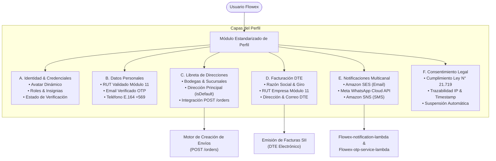

# Módulo Estandarizado de Perfil de Usuario (Standardized Profile Module)

El **Módulo Estandarizado de Perfil de Usuario** de Flowex proporciona una arquitectura unificada y modular para la gestión integral de identidad, libreta de direcciones para despachos, información tributaria para facturación electrónica (DTE), preferencias de notificación multicanal y trazabilidad regulatoria de consentimiento informado conforme a la legislación chilena (**Ley N° 21.719 sobre Protección de Datos Personales**).

Este módulo es transversal a todos los roles de la plataforma (`root`, `admin`, `driver`, `client`, `customer`).

---

## 🏛️ Arquitectura del Módulo de Perfil



---

## 🧩 Componentes y Secciones del Perfil

### 1. Cabecera de Identidad y Roles
* **Avatar y Estado:** Selector visual de avatares predeterminados y anillo indicador de estado en tiempo real (activo/en línea).
* **Insignias de Rol (`RoleBadge`):** Renderizado semántico de roles (`root`, `admin`, `driver`, `client`, `customer`) con control de privilegios.
* **Badge de Verificación:** Indicador de cuenta verificada por OTP y cumplimiento legal.

### 2. Datos Personales y Validación Chilena
* **Algoritmo Módulo 11:** Validación matemática estricta y formateo automático de RUT (`XX.XXX.XXX-X`).
* **Formato Telefónico E.164:** Normalización chilena a formato internacional (`+56 9 XXXX XXXX`).
* **Seguridad de Credenciales:** Validación de complejidad de contraseñas (mínimo 8 caracteres, mayúscula, minúscula, número y símbolo).

### 3. Libreta de Direcciones Frecuentes (Address Book)
Permite al usuario gestionar múltiples ubicaciones (bodegas centrales, oficinas, sucursales de despacho y retiro) para autocompletar dinámicamente las solicitudes de envío (`POST /orders`).
* **Dirección Predeterminada (`isDefault`):** Una única dirección principal activa para retiros. Al marcar una nueva como principal, el sistema reajusta automáticamente las demás.
* **Campos estructurados:** Alias, calle, número, departamento/módulo, ciudad/comuna, región, código postal y referencias para el conductor.

### 4. Datos de Facturación Tributaria (DTE)
Configuración centralizada para la emisión automática de Facturas Electrónicas de Transporte y Servicios Logísticos autorizadas por el SII:
* **Razón Social:** Nombre legal de la empresa o persona jurídica.
* **RUT Empresa:** RUT corporativo con validación Módulo 11.
* **Giro Comercial:** Actividad económica registrada en SII.
* **Dirección Tributaria & Correo:** Destino oficial para el envío de los XML y PDF de facturación.

### 5. Preferencias de Notificaciones Multicanal
Panel de control granular para activar o desactivar alertas transaccionales:
* **Amazon SES (Email):** Notificaciones transaccionales de órdenes, resúmenes y comprobantes PDF.
* **Meta WhatsApp Cloud API:** Alertas instantáneas de entrega, fotos POD y código PIN de 4 dígitos.
* **Amazon SNS (SMS):** Canal de respaldo para mensajes críticos de verificación.

> [!IMPORTANT]
> **Vinculación con Consentimiento:** Las notificaciones multicanal requieren que el consentimiento de tratamiento de datos personales esté activo. Si el usuario revoca su consentimiento, todos los canales externos se suspenden inmediatamente.

### 6. Consentimiento Legal y Cumplimiento Regulatorio (Ley N° 21.719)
Flowex implementa un registro auditable de consentimiento informado para el tratamiento de datos personales bajo la **Ley N° 21.719** de Chile:
* **Versión de Política:** Control de versiones contractuales (ej. `v2.4 (Ley N° 21.719)`).
* **Trazabilidad:** Registro inmutable de fecha/hora (`timestamp` ISO) y dirección IP de origen (`ipAddress`).
* **Revocabilidad:** Capacidad del titular de suspender o habilitar el tratamiento de sus datos en cualquier momento desde su perfil.

---

## 📋 Estructura de DTOs y Tipos TypeScript

```typescript
export type UserRole = 'root' | 'admin' | 'driver' | 'client' | 'customer';

export interface SavedAddress {
  id: string;
  alias: string;
  calle: string;
  numero: string;
  departamento?: string;
  ciudad: string;
  region: string;
  codigoPostal?: string;
  referencias?: string;
  isDefault: boolean;
}

export interface BillingInfo {
  razonSocial: string;
  rutEmpresa: string;
  giro: string;
  direccion: string;
  correo: string;
}

export interface NotificationPreferences {
  emailSes: boolean;
  whatsappMeta: boolean;
  smsSns: boolean;
}

export interface LegalConsent {
  accepted: boolean;
  policyVersion: string;
  timestamp: string;
  ipAddress?: string;
}

export interface User {
  id: string;
  name: string;
  email: string;
  phone: string;
  role: UserRole;
  roleTitle: string;
  avatar: string;
  department: string;
  rut?: string;
  isVerified?: boolean;
  addresses?: SavedAddress[];
  billingInfo?: BillingInfo;
  notificationPreferences?: NotificationPreferences;
  legalConsent?: LegalConsent;
}
```

---

## 🛡️ Especificación OpenAPI 3.1.0 Schemas

Los esquemas OpenAPI correspondientes se encuentran formalizados en `components/schemas` de la especificación:

* `#/components/schemas/SavedAddress`
* `#/components/schemas/BillingInfo`
* `#/components/schemas/NotificationPreferences`
* `#/components/schemas/LegalConsent`
* `#/components/schemas/UserProfile`
