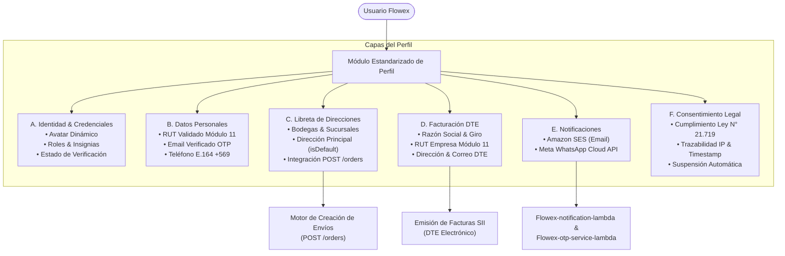

# Módulo Estandarizado de Perfil de Usuario (Standardized Profile Module)

El **Módulo Estandarizado de Perfil de Usuario** de Flowex proporciona una arquitectura unificada y modular para la gestión integral de identidad, libreta de direcciones para despachos, información tributaria para facturación electrónica (DTE), preferencias de notificación multicanal y trazabilidad regulatoria de consentimiento informado conforme a la legislación chilena (**Ley N° 21.719 sobre Protección de Datos Personales**).

Este módulo es transversal a todos los roles de la plataforma (`root`, `admin`, `driver`, `client`, `customer`).

---

## 🏛️ Arquitectura del Módulo de Perfil



---

## 🧩 Componentes y Secciones del Perfil

### 1. Cabecera de Identidad y Roles
* **Avatar y Estado:** Selector visual de avatares predeterminados y anillo indicador de estado en tiempo real (activo/en línea).
* **Insignias de Rol (`RoleBadge`):** Renderizado semántico de roles (`root`, `admin`, `driver`, `client`, `customer`) con control de privilegios.
* **Badge de Verificación:** Indicador de cuenta verificada por OTP y cumplimiento legal.

### 2. Datos Personales y Validación Chilena
* **Algoritmo Módulo 11:** Validación matemática estricta y formateo automático de RUT (`XX.XXX.XXX-X`).
* **Formato Telefónico E.164:** Normalización chilena a formato internacional (`+56 9 XXXX XXXX`).
* **Seguridad de Credenciales:** Validación de complejidad de contraseñas (mínimo 8 caracteres, mayúscula, minúscula, número y símbolo).

### 3. Libreta de Direcciones Frecuentes (Address Book)
Permite al usuario gestionar múltiples ubicaciones (bodegas centrales, oficinas, sucursales de despacho y retiro) para autocompletar dinámicamente las solicitudes de envío (`POST /orders`).
* **Dirección Predeterminada (`isDefault`):** Una única dirección principal activa para retiros. Al marcar una nueva como principal, el sistema reajusta automáticamente las demás.
* **Campos estructurados:** Alias, calle, número, departamento/módulo, ciudad/comuna, región, código postal y referencias para el conductor.

### 4. Datos de Facturación Tributaria (DTE)
Configuración centralizada para la emisión automática de Facturas Electrónicas de Transporte y Servicios Logísticos autorizadas por el SII:
* **Razón Social:** Nombre legal de la empresa o persona jurídica.
* **RUT Empresa:** RUT corporativo con validación Módulo 11.
* **Giro Comercial:** Actividad económica registrada en SII.
* **Dirección Tributaria & Correo:** Destino oficial para el envío de los XML y PDF de facturación.

### 5. Preferencias de Notificaciones
Panel para activar o desactivar los dos canales (`GET/PUT /users/me/notifications`):
* **Amazon SES (Email):** Notificaciones transaccionales de órdenes y comprobantes. Es también el único canal de los códigos de verificación y del segundo factor.
* **Meta WhatsApp Cloud API:** Avisos del pedido y código de entrega (PIN de 4 dígitos).

Flowex no envía SMS. Una preferencia `smsSns` guardada antes se ignora.

> [!IMPORTANT]
> **Vinculación con Consentimiento:** Las notificaciones multicanal requieren que el consentimiento de tratamiento de datos personales esté activo. Si el usuario revoca su consentimiento, todos los canales externos se suspenden inmediatamente.

### 6. Consentimiento Legal y Cumplimiento Regulatorio (Ley N° 21.719)
Flowex implementa un registro auditable e inmutable de consentimiento informado para el tratamiento de datos personales bajo la **Ley N° 21.719** de Chile y normativas internacionales (GDPR):
* **Versión de Política:** Control de versiones contractuales (vigente: `v2.5`).
* **Trazabilidad & Huella:** Registro inmutable de fecha/hora (`timestamp` ISO), dirección IP de origen (`ipAddress`) y canal (`web_registration`, `web_settings`).
* **Finalidades Granulares:** Separación explícita entre finalidades esenciales (contractuales) y accesorias/funcionales.
* **Revocabilidad Potestativa:** Capacidad del titular de suspender o habilitar finalidades no esenciales en cualquier momento desde su perfil de usuario.

---

## 🔒 Endpoints de Revisión y Gestión de Consentimiento

El módulo de perfil y autenticación expone las siguientes rutas REST para el autoservicio del titular y la inspección forense administrativa.

> [!NOTE]
> Las rutas del titular viven bajo `/auth/consent` (`Flowex-auth-api-lambda`). Las antiguas
> `/users/me/consentimiento`, `/users/me/revocar-consentimiento` y
> `/users/me/otorgar-consentimiento` respondían 404: API Gateway entrega `/users/*` a
> `Flowex-auth-admin-lambda`, que no las tiene.

### 1. `GET /auth/consent`
Consulta el estado vigente del consentimiento otorgado y el desglose detallado de finalidades autorizadas para el usuario autenticado.

* **Método:** `GET`
* **Autenticación:** Requerida (`Bearer <JWT>` o cookie HttpOnly `access_token`).
* **Respuesta Exitosa (`200 OK`):**
```json
{
  "userId": "usr_client_1771344000",
  "appId": "flowex",
  "status": "GRANTED",
  "policyVersion": "v2.5",
  "channel": "web_registration",
  "purposes": [
    {
      "purpose": "terms_and_conditions",
      "name": "Términos y Condiciones del Servicio",
      "description": "Aceptación obligatoria para la prestación del servicio logístico",
      "granted": true,
      "essential": true
    },
    {
      "purpose": "operational_notifications",
      "name": "Notificaciones Operacionales",
      "description": "Alertas críticas sobre el estado y despacho de envíos",
      "granted": true,
      "essential": true
    },
    {
      "purpose": "sms_whatsapp_alerts",
      "name": "Alertas por WhatsApp",
      "description": "Avisos del pedido por WhatsApp",
      "granted": true,
      "essential": false
    },
    {
      "purpose": "delivery_tracking",
      "name": "Seguimiento y Georreferenciación",
      "description": "Rastreo en tiempo real y posicionamiento geoespacial de envíos",
      "granted": true,
      "essential": false
    }
  ],
  "grantedAt": "2026-08-24T10:30:00.000Z",
  "updatedAt": "2026-08-24T10:30:00.000Z",
  "legalNotice": "Tratamiento de datos personales conforme a la Ley N° 21.719 sobre Protección de Datos Personales en Chile."
}
```

---

### 2. `POST /auth/consent/revoke`
Permite al titular ejercer su derecho de oposición/revocación sobre finalidades **no esenciales**. Al revocarse, se emite de forma asíncrona un evento `REVOKE_CONSENT` a Amazon SQS (`FlowexConsentQueue`).

* **Método:** `POST`
* **Autenticación:** Requerida (`Bearer <JWT>` o cookie HttpOnly `access_token`).
* **Cuerpo de Solicitud (`application/json`):**
```json
{
  "purposes": [
    "sms_whatsapp_alerts"
  ],
  "reason": "El titular solicita dejar de recibir alertas por WhatsApp"
}
```
* **Respuesta Exitosa (`200 OK`):**
```json
{
  "message": "Consentimiento revocado exitosamente para las finalidades seleccionadas",
  "userId": "usr_client_1771344000",
  "status": "PARTIALLY_REVOKED",
  "policyVersion": "v2.5",
  "purposes": [
    {
      "purpose": "terms_and_conditions",
      "name": "Términos y Condiciones del Servicio",
      "granted": true,
      "essential": true
    },
    {
      "purpose": "operational_notifications",
      "name": "Notificaciones Operacionales",
      "granted": true,
      "essential": true
    },
    {
      "purpose": "sms_whatsapp_alerts",
      "name": "Alertas por WhatsApp",
      "granted": false,
      "essential": false
    },
    {
      "purpose": "delivery_tracking",
      "name": "Seguimiento y Georreferenciación",
      "granted": true,
      "essential": false
    }
  ],
  "updatedAt": "2026-08-24T14:30:00.000Z"
}
```
* **Respuesta de Error si se intenta revocar finalidad esencial (`400 Bad Request`):**
```json
{
  "message": "No es posible revocar finalidades esenciales para la operación del servicio (Ley N° 21.719)",
  "forbiddenPurposes": ["terms_and_conditions"],
  "essentialPurposes": ["terms_and_conditions", "operational_notifications"]
}
```

---

### 3. `POST /auth/consent/grant`
Vuelve a otorgar finalidades accesorias revocadas. Mismo cuerpo que la revocación (sin `reason`):

```json
{ "purposes": ["sms_whatsapp_alerts"] }
```

La clave `sms_whatsapp_alerts` se conserva por compatibilidad con los registros existentes;
hoy cubre solo WhatsApp.

---

### 4. `GET /users/me/export` — Portabilidad
Entrega en JSON todo lo que la plataforma guarda **del titular de la sesión** (no recibe a
quién exportar). La entrega queda registrada como uso de datos (`EXPORT_PERSONAL_DATA`).

Incluye cuenta, perfil de cliente y de conductor, direcciones, libreta de contactos, pedidos
como cliente (con historial de estados y bultos), pagos, cupones, consentimientos (locales y de
la central) y el registro de qué consultó el personal, cuándo y con qué motivo. Excluye
contraseñas, códigos y tokens, los pedidos repartidos como conductor, las fotos y firmas de
entrega y la identidad del personal; la lista va en `export.excluded`.

```json
{
  "success": true,
  "complete": true,
  "missingSections": [],
  "export": {
    "formatVersion": "1.0",
    "generatedAt": "2026-09-24T12:00:00.000Z",
    "legalBasis": "Derecho de portabilidad, Ley N° 21.719 (art. 9)",
    "subject": { "id": "3c3c3c3c-…", "email": "cliente@flowex.cl" },
    "account": { "name": "…", "rut": "…", "phone": "…" },
    "addresses": [],
    "contactBook": [],
    "orders": [{ "tracking_number": "FLX-…", "statusHistory": [], "packages": [] }],
    "payments": [],
    "couponRedemptions": [],
    "consents": { "records": [], "central": { "available": true, "consents": [], "history": [] } },
    "dataAccessLog": [],
    "excluded": ["…"]
  }
}
```

Si una sección no se pudo leer, `complete` es `false` y `missingSections` dice cuál.

---

### 5. `GET /internal/users/{userId}/consents`
Endpoint interno (VPC / Consola Administrativa) para la inspección forense de consentimientos de un usuario específico. La consulta despacha obligatoriamente un evento de auditoría `PII_ACCESS_AUDIT` a la cola SQS.

* **Método:** `GET`
* **Autenticación:** Requerida con rol `admin` o `root` (`Bearer <JWT>`).
* **Headers Opcionales:** `x-audit-reason: Revisión legal de cuenta`
* **Respuesta Exitosa (`200 OK`):**
```json
{
  "userId": "usr_1771345600000",
  "appId": "flowex",
  "status": "GRANTED",
  "policyVersion": "v2.5",
  "channel": "web_registration",
  "purposes": [
    {
      "purpose": "terms_and_conditions",
      "name": "Términos y Condiciones del Servicio",
      "granted": true,
      "essential": true
    },
    {
      "purpose": "operational_notifications",
      "name": "Notificaciones Operacionales",
      "granted": true,
      "essential": true
    },
    {
      "purpose": "sms_whatsapp_alerts",
      "name": "Alertas por WhatsApp",
      "granted": true,
      "essential": false
    },
    {
      "purpose": "delivery_tracking",
      "name": "Seguimiento y Georreferenciación",
      "granted": true,
      "essential": false
    }
  ],
  "grantedAt": "2026-08-20T10:00:00.000Z",
  "updatedAt": "2026-08-20T10:00:00.000Z",
  "userIsActive": true
}
```

---

## ⚖️ Regla de No-Revocación ante Bloqueo de Usuario (*Non-Revocation on Block*)

> [!IMPORTANT]
> **Fundamento Jurídico (Ley N° 21.719 & GDPR):**
> La revocación de un consentimiento para el tratamiento de datos personales constituye un **derecho voluntario, personalísimo e indelegable del titular de los datos** (Derecho de Oposición ARCOP).
> 
> En consecuencia, cuando un administrador o el sistema desactiva, suspende o bloquea una cuenta de usuario (`isActive = false` o `is_active = false`):
> 1. **El consentimiento histórico otorgado NO se revoca automáticamente.**
> 2. **El estado de las finalidades aceptadas se mantiene bajo custodia legal inmutable.**
> 3. **Justificación:** Si el sistema revocara automáticamente el consentimiento al bloquear una cuenta fraudulenta o en mora, se destruiría la base jurídica que faculta a Flowex para auditar transacciones pasadas, defenderse en litigios comerciales o responder a requerimientos de la Agencia de Protección de Datos o tribunales.
> 
> En la respuesta de inspección administrativa (`GET /internal/users/{userId}/consents`), cuando `userIsActive = false`, se agrega la anotación legal:
> ```json
> {
>   "userIsActive": false,
>   "notice": "El consentimiento se mantiene vigente bajo custodia legal (Ley N° 21.719)",
>   "legalCustody": true
> }
> ```

---

## 🛡️ Desglose de Derechos ARCOP (Ley N° 21.719 / GDPR)

Flowex estructura el cumplimiento del catálogo de derechos del titular conforme al nuevo marco legal chileno:

| Derecho ARCOP | Definición en Flowex | Mecanismo de Ejercicio en la Plataforma |
|---|---|---|
| **A**cceso | Derecho del titular a conocer qué datos personales han sido recolectados, con qué fines y a quiénes se transfieren. | `GET /auth/consent`, `GET /users/me/export` y panel de perfil de usuario (`Flowex-frontend`). |
| **R**ectificación | Derecho a modificar, corregir o actualizar datos inexactos, desactualizados o incompletos (RUT, teléfono, razón social DTE). | `PUT /registration/requests/{email}/update-contact`, libreta de direcciones y configuración de facturación DTE. |
| **C**ancelación (Supresión) | Derecho a solicitar el borrado de datos cuando ha concluido la relación contractual y vencido el plazo legal de retención tributaria/logística. | Solicitud formal de derecho ARCOP procesada por el Oficial de Privacidad (DPO) y archivo final en S3 Glacier WORM. |
| **O**posición / Revocación | Derecho a revocar total o parcialmente el consentimiento sobre finalidades accesorias (alertas WhatsApp, seguimiento). | `POST /auth/consent/revoke` y `POST /auth/consent/grant` (no aplica a finalidades esenciales del contrato de transporte). |
| **P**ortabilidad | Derecho a recibir los datos personales en un formato estructurado, interoperable y de uso común. | `GET /users/me/export` (JSON), botón "Exportar Datos" del perfil. |

---

## 📋 Estructura de DTOs y Tipos TypeScript

```typescript
export type UserRole = 'root' | 'admin' | 'driver' | 'client' | 'customer';

export interface SavedAddress {
  id: string;
  alias: string;
  calle: string;
  numero: string;
  departamento?: string;
  ciudad: string;
  region: string;
  codigoPostal?: string;
  referencias?: string;
  isDefault: boolean;
}

export interface BillingInfo {
  razonSocial: string;
  rutEmpresa: string;
  giro: string;
  direccion: string;
  correo: string;
}

export interface NotificationPreferences {
  emailSes: boolean;
  whatsappMeta: boolean;
}

/** Ficha del conductor: el hub es el del vehículo asignado; un dato inexistente llega null. */
export interface DriverDetails {
  licenseNumber: string | null;
  licenseClass: string | null;
  licenseExpiryDate: string | null;
  vehicleType: string | null;
  vehiclePlate: string | null;
  vehicleLabel: string | null;
  hubId: string | null;
  hubName: string | null;
}

export interface ConsentPurpose {
  purpose: string;
  name?: string;
  description?: string;
  granted: boolean;
  essential: boolean;
}

export type ConsentStatus = 'GRANTED' | 'REVOKED' | 'PARTIALLY_REVOKED';

export interface UserConsent {
  userId: string;
  appId: string;
  status: ConsentStatus;
  policyVersion: string;
  channel: string;
  purposes: ConsentPurpose[];
  grantedAt: string;
  updatedAt: string;
  legalNotice?: string;
  userIsActive?: boolean;
  notice?: string;
  legalCustody?: boolean;
}

export interface RevokeConsentRequest {
  purposes: string[];
  reason?: string;
}

export interface LegalConsent {
  accepted: boolean;
  policyVersion: string;
  timestamp: string;
  ipAddress?: string;
}

export interface User {
  id: string;
  name: string;
  email: string;
  phone: string;
  role: UserRole;
  roleTitle: string;
  avatar: string;
  rut?: string;
  isVerified?: boolean;
  addresses?: SavedAddress[];
  billingInfo?: BillingInfo;
  notificationPreferences?: NotificationPreferences;
  legalConsent?: LegalConsent;
}
```

---

## 🛡️ Especificación OpenAPI 3.1.0 Schemas

Los esquemas OpenAPI correspondientes se encuentran formalizados en `components/schemas` de la especificación:

* `#/components/schemas/SavedAddress`
* `#/components/schemas/BillingInfo`
* `#/components/schemas/NotificationPreferences`
* `#/components/schemas/LegalConsent`
* `#/components/schemas/ConsentPurpose`
* `#/components/schemas/UserConsent`
* `#/components/schemas/RevokeConsentRequest`
* `#/components/schemas/UserProfile`
