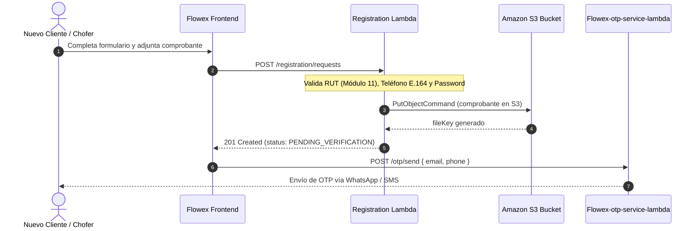

# Flujo de Registro y Validación de RUT (Registration)

El proceso de registro en Flowex (`Flowex-registration-public-lambda`) implementa una secuencia de validaciones estrictas y carga de documentación en la nube antes de someter la cuenta al proceso de verificación por OTP o revisión administrativa.

---

## 📋 Reglas de Validación de Negocio

### 1. Validación de RUT Chileno (Algoritmo Módulo 11)
Todo usuario debe ingresar un RUT válido en Chile. El sistema procesa el cuerpo numérico y calcula el dígito verificador esperado mediante la fórmula:

$$\text{Suma} = \sum_{i=0}^{n} d_i \times m_i \quad \text{donde } m \in [2, 3, 4, 5, 6, 7]$$

$$\text{Resto} = 11 - (\text{Suma} \pmod{11})$$

$$\text{DV} = \begin{cases} \text{'0'}, & \text{si Resto} = 11 \\ \text{'K'}, & \text{si Resto} = 10 \\ \text{Resto}, & \text{en otro caso} \end{cases}$$

Si el dígito verificador no coincide, la solicitud es rechazada inmediatamente con error `400 Bad Request`.

### 2. Formato de Teléfono Celular (Estándar E.164)
* Debe comenzar con el prefijo internacional de Chile `+569` seguido de 8 dígitos numéricos (ejemplo: `+56987654321`) o formato internacional general `+\d{7,15}`.

### 3. Fortaleza de la Contraseña
* Longitud mínima de **8 caracteres**.
* Al menos **1 letra mayúscula** (`A-Z`).
* Al menos **1 letra minúscula** (`a-z`).
* Al menos **1 número** (`0-9`).
* Al menos **1 carácter especial** (`!@#$%^&*()_+-=[]{};':"|,.<>/?`).

### 4. Carga de Comprobantes a Amazon S3
* Formatos admitidos: `image/jpeg`, `image/png`, `application/pdf`.
* Tamaño máximo por archivo: **5 MB**.
* El comprobante se almacena automáticamente en el bucket S3 en la ruta: `comprobantes/{email}/{timestamp}_{fileName}`.

---

## 🔄 Diagrama de Secuencia del Registro



---

## 📡 Endpoints del Módulo de Registro

### 1. Crear Solicitud de Registro (`POST /registration/requests`)

#### Ejemplo Solicitud: Cliente Final (`client`)
```json
{
  "email": "juan.cliente@gmail.com",
  "name": "Juan Pérez Silva",
  "rut": "18.345.678-K",
  "phone": "+56991234567",
  "password": "PasswordSegura2026!",
  "role": "client",
  "consentimiento": true,
  "housingType": "casa",
  "streetAndNumber": "Av. Las Condes 10200",
  "region": "Región Metropolitana",
  "comuna": "Las Condes",
  "transportType": ["maritimo", "aereo"],
  "facturaRequired": true,
  "razonSocial": "Pérez Logística SpA",
  "rutEmpresa": "76.543.210-9",
  "giro": "Comercio Minorista",
  "comprobante": "data:application/pdf;base64,JVBERi0xLjQKJ...",
  "comprobanteFileName": "comprobante_domicilio.pdf"
}
```

#### Ejemplo Solicitud: Conductor / Repartidor (`driver`)
```json
{
  "email": "carlos.chofer@gmail.com",
  "name": "Carlos Chofer González",
  "rut": "15.987.654-3",
  "phone": "+56987654321",
  "password": "DriverPassword2026!",
  "role": "driver",
  "consentimiento": true,
  "licenseNumber": "LIC-15987654-CL",
  "vehicleType": "Furgón / Camioneta",
  "vehiclePlate": "LJ-89-21",
  "comprobante": "data:image/jpeg;base64,/9j/4AAQSkZJRg...",
  "comprobanteFileName": "licencia_conducir.jpg"
}
```

#### Respuesta Exitosa (`201 Created`)
```json
{
  "message": "Solicitud registrada correctamente. Proceda a validar mediante OTP.",
  "request": {
    "email": "juan.cliente@gmail.com",
    "name": "Juan Pérez Silva",
    "rut": "18345678-K",
    "phone": "+56991234567",
    "role": "client",
    "status": "PENDING_VERIFICATION",
    "is_verified": false,
    "is_email_verified": false,
    "is_phone_verified": false,
    "comprobanteKey": "comprobantes/juan.cliente%40gmail.com/1771344000000_comprobante_domicilio.pdf",
    "createdAt": "2026-08-19T10:00:00.000Z"
  }
}
```

---

### 2. Consultar Estado de Solicitud (`GET /registration/requests/{email}/status`)
Retorna el estado de verificación y si la solicitud requiere validación por OTP.

* **Parámetro URL:** `email` (URL Encoded).
* **Respuesta (`200 OK`):**
```json
{
  "exists": true,
  "email": "juan.cliente@gmail.com",
  "status": "PENDING_VERIFICATION",
  "is_verified": false,
  "is_email_verified": false,
  "is_phone_verified": false,
  "requires_otp": true
}
```

---

### 3. Actualizar Datos de Contacto (`PUT /registration/requests/{email}/update-contact`)
Permite corregir el número de teléfono o correo en caso de haberlo ingresado con error durante el onboarding inicial.

* **Cuerpo de Solicitud:**
```json
{
  "phone": "+56999887766",
  "email": "juan.perez.nuevo@gmail.com"
}
```
* **Respuesta (`200 OK`):**
```json
{
  "message": "Contact updated successfully",
  "originalEmail": "juan.cliente@gmail.com",
  "updatedEmail": "juan.perez.nuevo@gmail.com",
  "updatedPhone": "+56999887766"
}
```

---

### 4. Re-subir Comprobante (`PUT /registration/requests/{email}/reupload-comprobante`)
Permite reemplazar un documento rechazado o ilegible.

* **Cuerpo de Solicitud:**
```json
{
  "comprobante": "data:application/pdf;base64,JVBERi0xLjQK...",
  "comprobanteFileName": "nuevo_comprobante_residencia.pdf"
}
```
* **Respuesta (`200 OK`):**
```json
{
  "message": "Comprobante reuploaded successfully",
  "comprobanteKey": "comprobantes/juan.cliente%40gmail.com/1771344500000_nuevo_comprobante_residencia.pdf",
  "status": "PENDING_VERIFICATION"
}
```
