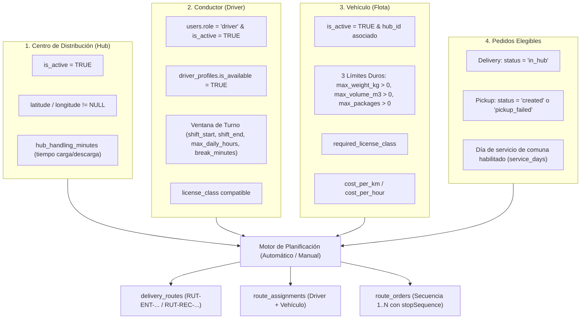

# Requisitos para la Creación de Rutas: Hub, Driver y Vehículos

Este documento describe en detalle los requisitos de configuración, dependencias en base de datos y reglas de negocio necesarias para generar rutas de despacho y recolección en Flowex, tanto en la **planificación automática diaria** (`POST /internal/routes/plan-daily`) como en la **creación manual desde el panel de administración** (`POST /internal/routes/manual`).

---

## 1. Visión General de la Arquitectura

Una ruta en Flowex vincula un **Hub** (centro de operaciones y punto de inicio/retorno), un **Conductor (Driver)** en turno activo, un **Vehículo** con capacidades volumétricas y de peso definidas, y un conjunto ordenado de **Pedidos**.

---

## 2. Requisitos del Hub (Centro de Distribución)

El Hub actúa como el **Depot**: cada ruta inicia y termina obligatoriamente en las coordenadas de su Hub. Con varios hubs, la ruta sale del hub de su vehículo; el detalle de cómo se reparten pedidos, vehículos y conductores está en [Planificación de Rutas](/route-planning#varios-hubs).

* **Tabla de BD:** `hubs` (ver migración `003_geography_and_hubs.sql`).
* **Código del Hub:** Por defecto `HUB-STGO-CENTRAL` (o el configurado en la solicitud).

### Condiciones Obligatorias
1. **Existencia y Estado:**
   * El hub debe existir con el código consultado.
   * `is_active = TRUE`. Si está inactivo, el servicio arroja error explícito:
     > *"El hub 'HUB-STGO-CENTRAL' existe pero está dado de baja. Reactívelo en Admin > Hubs."*
2. **Georreferenciación Obligatoria:**
   * `latitude` y `longitude` **no pueden ser `NULL`**. Si alguna falta, el planificador se detiene:
     > *"El hub 'HUB-STGO-CENTRAL' existe y está activo pero no tiene coordenadas (latitud o longitud en NULL). Edítelo en Admin > Hubs e ingrese latitud y longitud."*
3. **Tiempo de Operación en Hub (`hub_handling_minutes`):**
   * Configurado en `planner_settings` (por defecto entre 20 y 30 minutos).
   * Se suma al inicio para la carga de bultos y al final para la liquidación/descarga.
4. **Regla de Estado de los Pedidos en Hub:**
   * **Ruta de Entrega (`delivery`):** Los pedidos deben estar en estado `in_hub`. No se pueden planificar pedidos que no hayan sido recibidos físicamente en el hub.
   * **Ruta de Recogida (`pickup`):** Los pedidos deben estar en estado `created` o `pickup_failed`.

---

## 3. Requisitos del Conductor (Driver)

El conductor aporta el tiempo útil de trabajo (jornada legal) y su habilitación de conducción.

* **Tablas de BD:** `users` y `driver_profiles` (migraciones `002_users_and_auth.sql` y `018_fleet_and_driver_capacity.sql`).

### Condiciones Obligatorias
1. **Usuario Activo:**
   * `users.role = 'driver'` y `users.is_active = TRUE`.
2. **Disponibilidad Operativa:**
   * `driver_profiles.is_available = TRUE`. Si un conductor está con licencia médica o vacaciones, se marca `is_available = FALSE` sin necesidad de desactivar su usuario.
3. **Definición de Turno y Jornada Laboral:**
   * `shift_start` (ej. `'09:00'`): Hora de inicio de turno.
   * `shift_end` (ej. `'18:00'`): Hora de fin de turno.
   * `break_minutes` (ej. `30` o `45` min): Tiempo legal de colación/descanso.
   * `max_daily_hours` (ej. `8`): Límite máximo legal de horas efectivas diarias.
   
   **Fórmula de Minutos Disponibles:**
   $$\text{Jornada Neta (min)} = \min\Big((\text{shift\_end} - \text{shift\_start}) - \text{break\_minutes}, \; \text{max\_daily\_hours} \times 60\Big)$$

4. **Planificación Intradiaria y Rutas Previas:**
   * Si la planificación se realiza durante el día de la fecha (`today`), solo se computan los minutos restantes desde la hora actual (`availableFromMinutes`).
   * Si el conductor ya tiene rutas activas en la fecha (`aceptada`, `en_curso`), los minutos ya comprometidos (`usedMinutes`) se restan de la jornada disponible.
5. **Licencia de Conducir (`license_class`):**
   * Debe ser compatible con la licencia requerida por el vehículo asignado (ej. Clase B para camionetas/furgones de hasta 3.500 kg, Clase A4 para camiones simples).
6. **Vehículo Predeterminado (`default_vehicle_id`):**
   * Relación opcional pero recomendada que asocia al conductor con su vehículo habitual, permitiendo preselección automática en la creación manual.

---

## 4. Requisitos del Vehículo (Flota)

El vehículo establece la restricción de capacidad volumétrica y de peso que determina cuántos pedidos pueden consolidarse en una ruta.

* **Tabla de BD:** `vehicles` (migraciones `018_fleet_and_driver_capacity.sql` y `076_vehicle_types_table.sql`).

### Condiciones Obligatorias
1. **Estado y Asignación:**
   * `is_active = TRUE`.
   * `hub_id`: Debe pertenecer al Hub que origina el despacho.
2. **Tres Límites Duros de Capacidad (Obligatoriamente > 0):**
   El motor de bin-packing propio y Google Cloud Route Optimization API rechazan o descartan vehículos que no definan valores positivos en:
   * `max_weight_kg > 0`: Carga máxima permitida en kilogramos.
   * `max_volume_m3 > 0`: Capacidad volumétrica útil en metros cúbicos ($m^3$).
     > **Nota Operativa:** En logística urbana de paquetería e-commerce, el volumen cúbico (`max_volume_m3`) es casi siempre la restricción crítica que se agota antes que el peso.
   * `max_packages > 0`: Límite máximo de paquetes o bultos físicos independientes que caben en el móvil.
3. **Requisitos de Licencia y Zonas:**
   * `required_license_class`: Tipo de licencia requerido para operar el móvil.
   * `allowed_zones`: Arreglo opcional de comunas o zonas permitidas (si el vehículo tiene restricciones de tránsito).
4. **Métricas de Costo (Función Objetivo):**
   * `cost_per_km` y `cost_per_hour`: Utilizados por el optimizador matemático para calcular la solución más económica para la flota.

---

## 5. Dinámica de Creación de Rutas

### Modalidad A: Planificación Automática Diaria (`POST /internal/routes/plan-daily`)
* **Disparador:** Típicamente ejecutado por regla de EventBridge a las 12:00 hrs (corte diario) o bajo demanda por rol `root`.
* **Flujo:**
  1. Carga Hub activo (`loadHub`).
  2. Carga Vehículos activos (`loadVehicles`) y Conductores disponibles en turno (`loadDrivers`).
  3. Carga paradas elegibles (`loadEligibleStops`) filtrando por cobertura de comuna y día de servicio (`service_days`).
  4. Realiza el empaquetado (Bin-Packing First-Fit Decreasing) respetando volumen, peso y tiempo de jornada.
  5. Asigna secuencia de paradas (`stopSequence`) optimizando distancias.
  6. Guarda rutas en estado `planned` con asignación en `route_assignments` y pedidos en `route_orders`.

### Modalidad B: Creación Manual (`POST /internal/routes/manual`)
* **Uso:** El despachador arma o ajusta rutas ad-hoc desde el panel de administración.
* **Flujo y Validaciones:**
  1. El admin selecciona fecha (`date`), tipo (`kind: 'pickup' | 'delivery'`), conductor (`driverId`) y lista de IDs de pedidos (`orderIds`).
  2. El sistema resuelve el vehículo asignado (mediante `default_vehicle_id` del perfil de conductor).
  3. Ejecuta `previewManualRoute`:
     * Calcula distancia total, paradas y tiempo estimado de viaje más servicio en cada parada.
     * Evalúa si supera la jornada disponible o la capacidad de carga.
     * Detecta pedidos bloqueados (ej. pedidos que ya están en una ruta en curso o con entregas ya completadas).
  4. Si existen violaciones de capacidad o tiempo, la creación se bloquea salvo que se envíe explícitamente `allowOverLimits: true` (quedando registradas como advertencias operativas).
  5. Se cancelan o desvinculan las rutas anteriores no iniciadas de donde provenían los pedidos y se persiste la nueva ruta.

---

## 6. Lista de Verificación Previa (Checklist Operativo)

Antes de lanzar una planificación o crear una ruta, verificar:

- [ ] **Hub:** Existe, está activo (`is_active = true`), y tiene latitud y longitud válidas.
- [ ] **Conductores:** Al menos un conductor con rol `driver`, usuario activo, `is_available = true`, y horario de turno (`shift_start` - `shift_end`) válido.
- [ ] **Vehículos:** Al menos un vehículo activo asignado al Hub con `max_weight_kg > 0`, `max_volume_m3 > 0` y `max_packages > 0`.
- [ ] **Asignación Vehículo-Driver:** El conductor tiene asignado `default_vehicle_id` o se cuenta con flota libre compatible con su licencia.
- [ ] **Pedidos Elegibles:** Pedidos con coordenadas válidas dentro de las 45 comunas de cobertura y en estado correspondiente (`in_hub` para entregas, `created`/`pickup_failed` para retiros).
